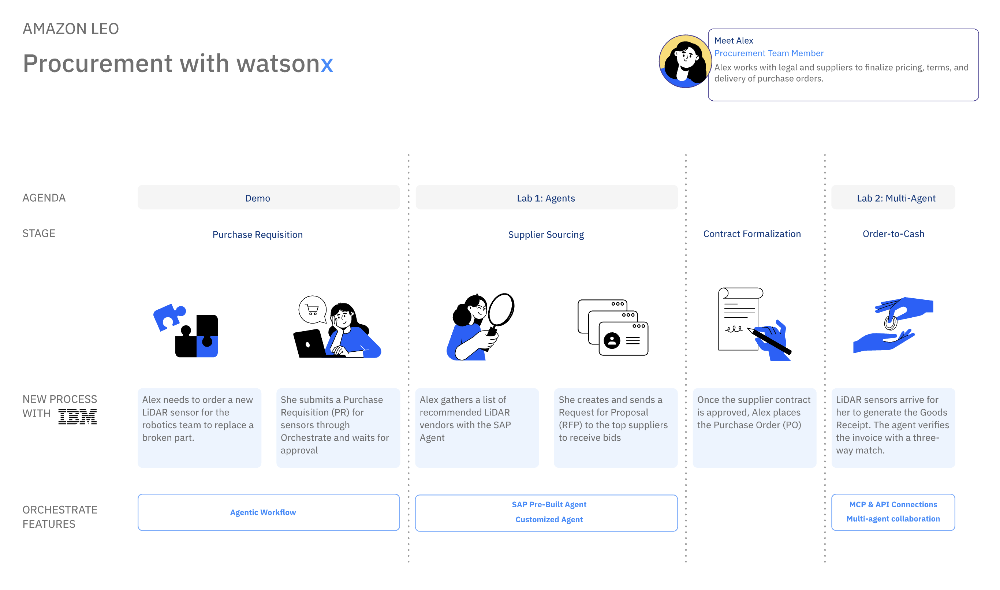

# Procurement Workflow Automation with watsonx Orchestrate AI Agents

Ever spent hours evaluating suppliers or drafting RFPs manually? These tasks can be time-consuming and prone to errors.

In this hands-on workshop, we’ll show you how to leverage IBM’s watsonx Orchestrate AI Agents to streamline procurement processes, making them faster, smarter, and more reliable.

## 🧠 What You’ll Learn
In this session, you’ll:
* Learn how to orchestrate workflows in watsonx Orchestrate using both pre-built and custom AI Agents.
* Automate supplier sourcing and RFP generation through conversational interactions with the agent.
* Explore integration possibilities with enterprise systems like SAP S/4HANA.

## 💼 Use Cases

1. **Sourcing Potential Supplier**  

Imagine you’re part of Amazon’s procurement team tasked with finding the best supplier for a product:

* Multiple suppliers exist with varying costs and delivery timelines.
* Instead of manually comparing options, your watsonx Orchestrate agent:
    - Connects to SAP S/4HANA using pre-built agents.
    - Retrieves supplier data including cost and delivery time.
    - Applies decision logic to recommend the optimal supplier.
    - Presents the result in a clear, actionable format.

In minutes, you’ll know the best supplier based on your priorities.

2. **RFP Generation**  

Drafting an RFP can be tedious and repetitive. With a custom agent:

* The agent uses a predefined template.
* It asks you a few key questions (e.g., scope, delivery expectations, timeline).
* Generates a polished, downloadable RFP document ready for distribution.

No more manual formatting—just fast, accurate RFPs tailored to your needs.

3. **Order-to-Cash Validation**  

Validating invoices against purchase orders and goods receipts is critical for financial accuracy. With a multi-agent solution:

* The system performs a three-way match between Purchase Order, Goods Receipt, and Invoice.
* Detects discrepancies in quantity or price before payment processing.
* Provides clear validation results with pass/fail status and failure reasons.

This automation reduces manual checks, prevents costly errors, and accelerates the O2C cycle.

## 🚀 Getting Started
Please find the step-by-step instructions here on how you can implement these use cases.

1. [Lab 1 - Sourcing Potential Supplier](labs/Lab%201%20-%20Sourcing%20Potential%20supplier/README.md)
2. [Lab 2 - RFP Generation](labs/Lab%202%20-%20RFP%20Generation/README.md)
3. [Lab 3 - Order-to-Cash (Optional)](labs/Lab%203%20-%20Order-to-Cash/README.md)

## Resources
* [watsonx Orechestrate Documentation](https://www.ibm.com/docs/en/watsonx/watson-orchestrate/base)
* [watsonx Orechestrate ADK](https://developer.watson-orchestrate.ibm.com/)

## 🧩 Credits

IBM Client Engineering Team

#### Business Technical Leader 
* Orion Krawitt

#### Instructors
* Pengxiang Xu
* Vrisan Dubey
* Chaithra M. Nagaraj
* Dustin Lee

#### AI Engineers
* M N Navneeth
* Mahesh Mishra
* Dileep Vadlamudi

#### Designer
* Amy Luo

