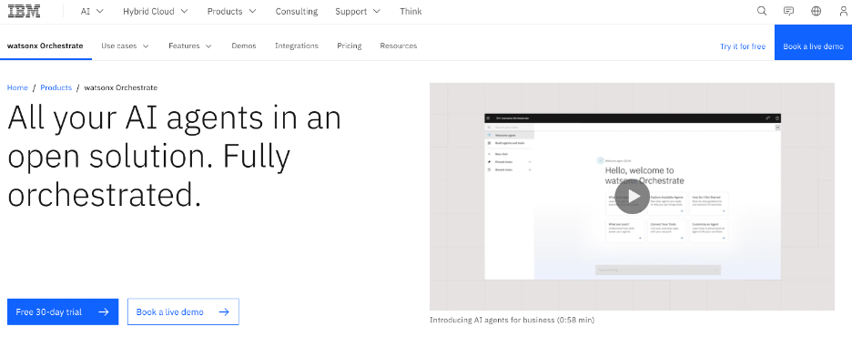
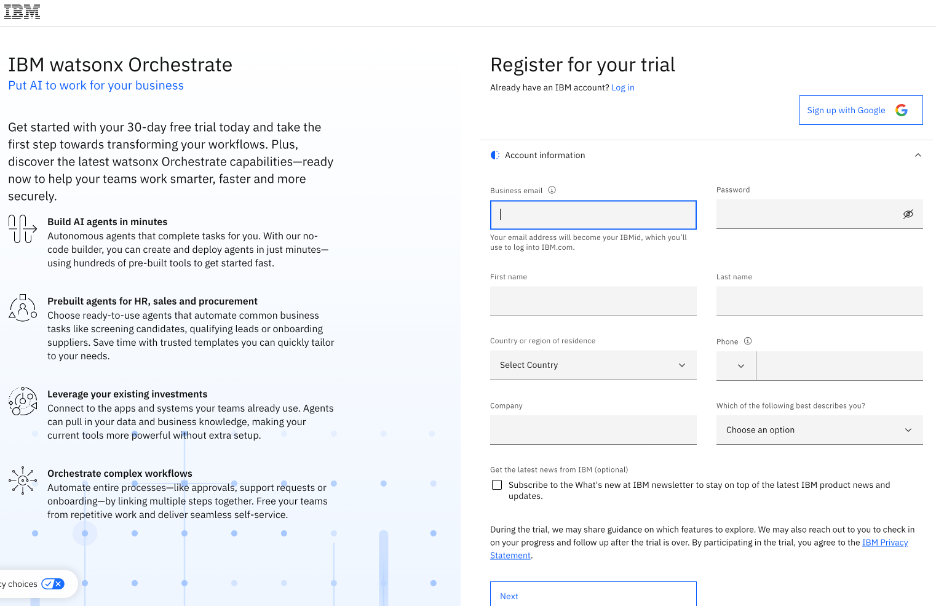
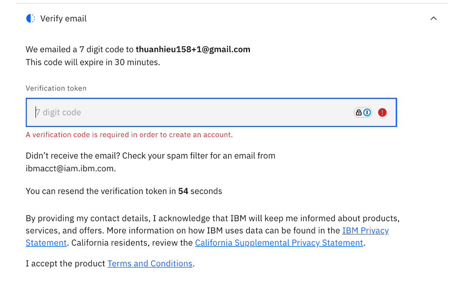
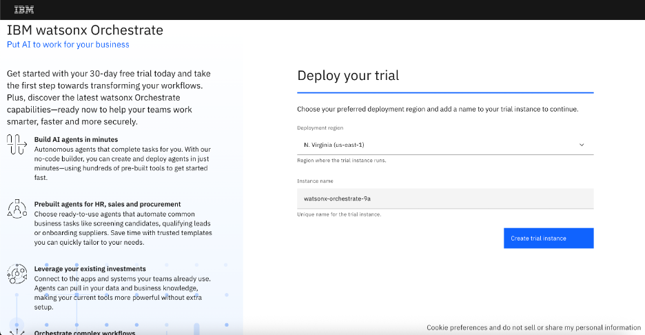
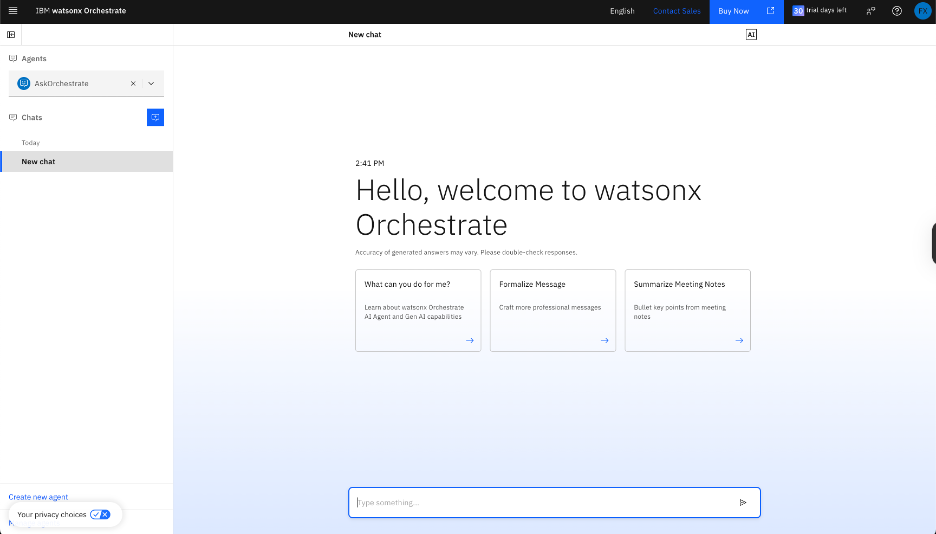

# watsonx Orchestrate Setup

This is a prerequisite to the AskProcurement Agentic AI Bootcamp. Please follow the instructions to signup your watsonx Orechestrate instance.

## Table of Content
* [Step 1. Sign Up watsonx Orchestrate](#step-1-sign-up-watsonx-orchestrate)
* [Step 2. Verify Email](#step-2-verify-email)
* [Step 3. Select a watsonx Orchestrate Instance](#step-3-select-a-watsonx-orchestrate-instance)
* [Step 4. Landing on the watsonx Orchestrate Page](#step-4-landing-on-the-watsonx-orchestrate-page)

## Step 1. Sign Up watsonx Orchestrate
1. Go to the watsonx Orchestrate product page and sign up for the 30-day trial

2. Log in / Sign up   
    Option 1: Already have an IBM account?
    * Choose the `Log in` option.  

    Option 2: No IBM account yet?
    * Follow the prompts to fill out the infomation requested

   

## Step 2. Verify Email
1. Enter the verification token sent to your email

## Step 3. Select a watsonx Orchestrate Instance
1. Choose `N. Virginia (us-east-1)` as the deployment region
2. Keep the default instance name
3. Click `Create trail instance`

## Step 4. Landing on the watsonx Orchestrate Page
1. Wait for the watsonx Orchestrate instance to be provisioned
2. If you reached the `watsonx Orchestrate landing page`, you have just unlocked your superpower. Please let your instructor know, and wait for further instructions.

[← Back to Table of contents](#table-of-content) | [← Back to Main Page](../README.md) | [Next: Lab 1 - Sourcing Potential Supplier →](../labs/Lab%201%20-%20Sourcing%20Potential%20Supplier/README.md)