# Lab 1 : Sourcing Potential Supplier

## Table of Contents
- [1. Introduction](#introduction)
- [2. Accessing watsonx Orchestrate UI](#accessing-ui)
- [3. Building the Potential Supplier Agent](#building-potential-supplier-agent)
    - [3.1 Catalog Management Agent](#catalog-management-agent)
    - [3.2 Supplier Management Agent](#supplier-management-agent)
    - [3.3 Sourcing Potential Supplier Agent (Master Agent)](#master-agent)
        - [3.3.1 Creating an Agent from scratch](#creating-from-scratch)
        - [3.3.2 Adding Collaborator Agents](#adding-collab-agents)
        - [3.3.3 Adding Behvior to the Agent](#adding-behavior)
- [4. Testing the agent](#testing-agent)
- [5. Deploying the Agent (Optional)](#deploying-agent)
- [6. Summary](#summary)


<details open id="introduction">
<summary><h2>1. Introduction</h2></summary>

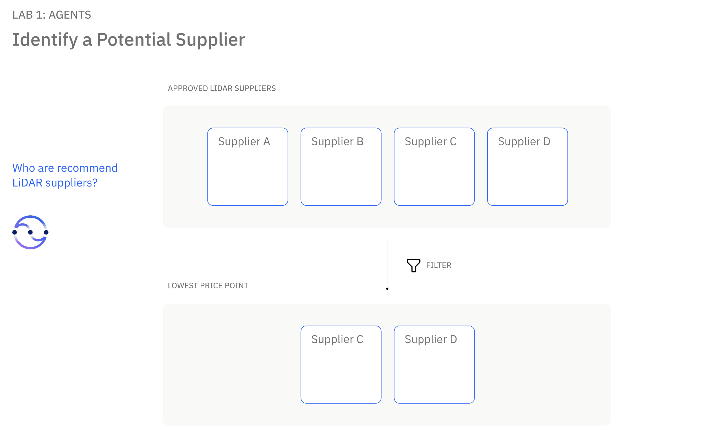

This lab focuses on automating the process of sourcing potential suppliers using watsonx Orchestrate. The goal is to optimize procurement decisions by leveraging AI-driven workflows and enterprise system integrations.

The specific scenario involves identifying the best supplier for a given product based on key factors such as **cost** and **delivery time**. These decisions are critical for ensuring timely procurement and cost efficiency in large-scale operations.

In this lab, you will build an AI-powered agent within watsonx Orchestrate that:

* Integrates with **SAP S/4HANA** using pre-built agents to access supplier data.
* Retrieves and analyzes supplier information including pricing and delivery timelines.
* Applies decision logic to recommend the most suitable supplier.
* Presents the recommendation in a clear, actionable format for procurement teams.

By automating supplier sourcing, procurement teams can:

* Eliminate manual comparison of multiple suppliers.
* Ensure data-driven, consistent decision-making.
* Accelerate procurement cycles and improve operational efficiency.

[← Back to Table of contents](#table-of-contents) 
</details>


<details open id="accessing-ui">
<summary><h2>2. Accessing watsonx Orchestrate UI</h2></summary>

1. To access the watsonx Orchestrate console, go to the [Resources list on the IBM Cloud homepage](https://cloud.ibm.com/resources).
 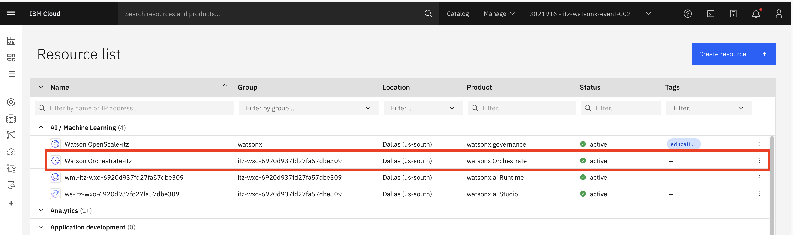

2. Expand the **AI / Machine Learning** section and select the resource that has **watsonx Orchestrate** in the Product column, as shown above. Then click **Launch watsonx Orchestrate**.

  

This opens the watsonx Orchestrate console.

  

[← Back to Table of contents](#table-of-contents)

<details open id="building-potential-supplier-agent">
<summary><h2>3. Building the Potential Supplier Agent</h2></summary>

In this section we will deep dive into the steps in building the Potential Supplier Identifier Agent. 

This will consist of two sub(child) agents.
1. **Catalog Management Agent (Prebuilt):** This agent is responsible for fetching the catalog/materials information from the SAP S4 Hana system. It manages the purchasing information records and links the supplier information to the material.

2. **Supplier Management Agent (Prebuilt):** This agent is responsible for fetching the available insight information about suppliers such as their address, contact persons, delivery time details etc.

The above two agents will be managed by a Master agent **Souring Potential Supplier Agent** which will basically route the queries to the appropriate child agent.
Let us get started with building the child agents first.

<details open id="catalog-management-agent">
<summary><h3>3.1 Catalog Management Agent</h3></summary>

1. Go to the **☰** hamburger menu from the top left and select the **Build** option. 
    

2. This will take us to the Agent Builder page, Click on the **Create Agent +** button as shown below
    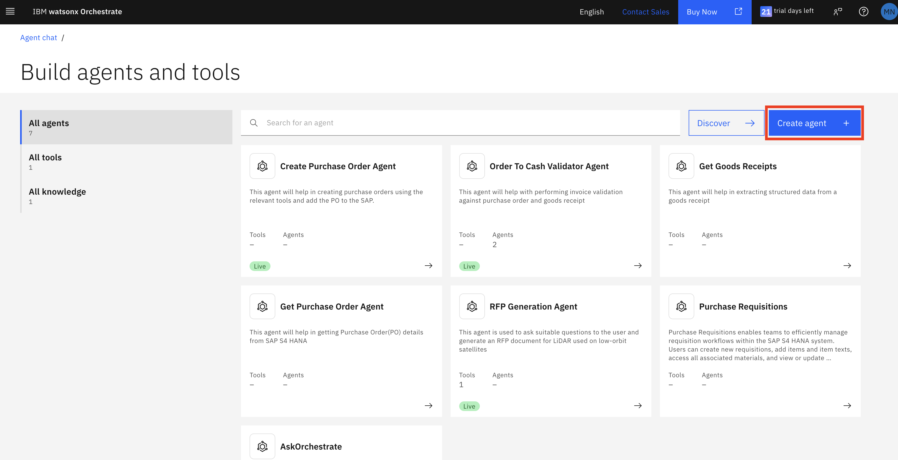

3. Since we will be using a pre built agent for this, select the **Choose from template** option.
    

4. This opens up the page which contains all the prebuilt agents available on watsonx Orchestrate platform, Scroll to the Apps section from the left menu and search for `SAP`, From the filtered list select the **SAP S4 Hana** option as shown below
    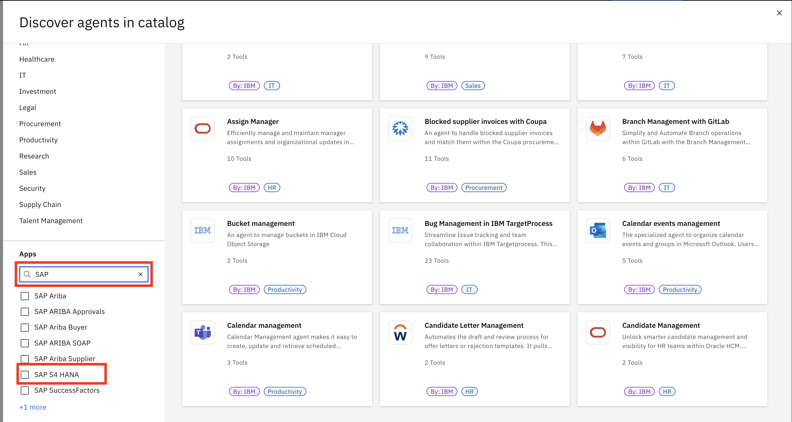

5. Click on the **Catalog Management with S4 Hana**
    

6. This opens up the Agent card which contains information about the Agent such the model, tools used and description of the agent, Click on **Use as template**
    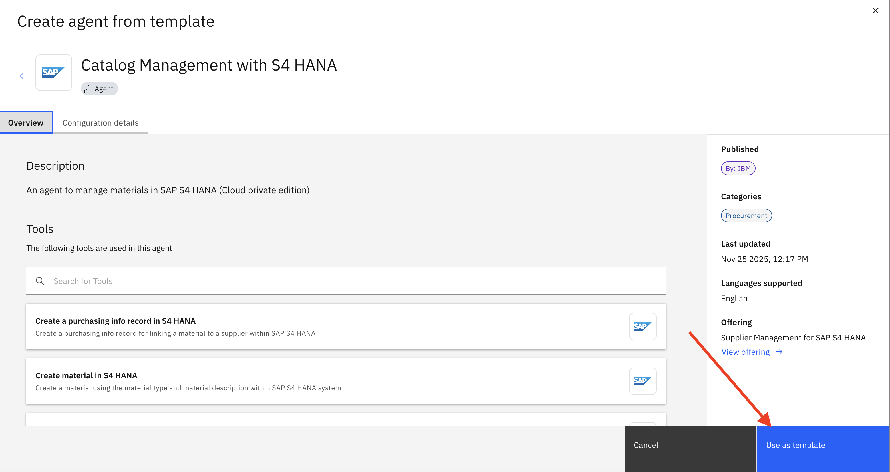

7. This gives us the landing page for the agent.
    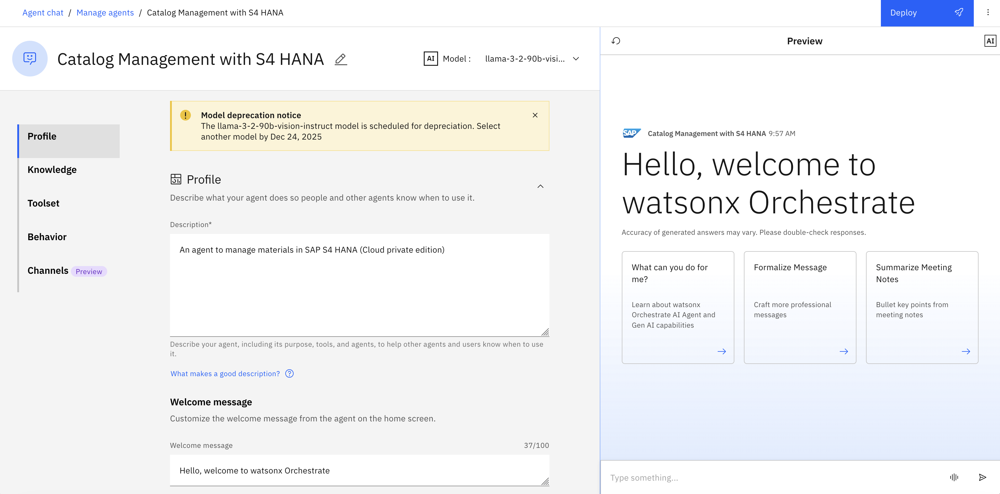

8. Scroll down to the toolset section or click on the **Toolset** option. It will take some time for all the tools to be imported, please wait till it completes. Once it is complete you should see all the imported tools successfully.
    

8. Let us rename the agent and rephrase the description to make it more meaningful for our use case.

    - **Name:** This describes the name of the Agent.
    ```
    sap_catalog_management_agent
    ```
    - **Description:** This describes what tasks the agent will be performing, this will be useful when we are building a multi agentic solution when agents needs to discover suitable agents based on the task in hand.
    ```
    An agent supports end-to-end catalog operations including creating, retrieving, and updating materials, managing purchasing info records, linking suppliers to materials, and modifying pricing conditions from SAP S4 HANA system.
    ```
    

[← Back to Table of contents](#table-of-contents)
</details>
<details open id="supplier-management-agent">
<summary><h3>3.2 Supplier Management Agent</h3></summary>

1. Click on the **Manage Agents** option to go back to the agent builder page.
    


2. Click on the **Create Agent +** button and select **Choose from template** option.
    
    

3. Scroll to the Apps section from the left menu and search for `SAP`, From the filtered list select the **SAP S4 Hana** option.
    

4. Select the **Supplier Management with S4 Hana** Agent and click on **Use as template**
    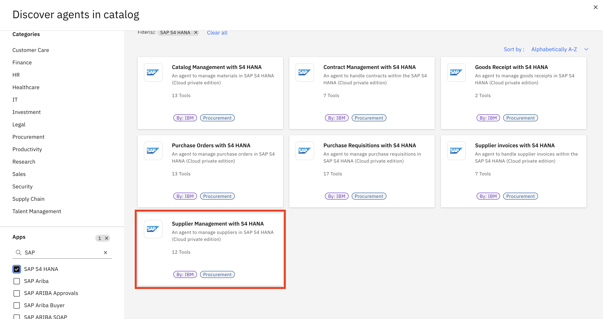
    

5. Scroll down to the toolset section or click on the **Toolset** option. It will take some time for all the tools to be imported, please wait till it completes. Once it is complete you should see all the imported tools successfully.
    

6. Let us rename the agent and rephrase the description to make it more meaningful for our use case.

    - **Name:** 
    ```
    sap_supplier_management_agent
    ```
    - **Description:** 
    ```
    An agent to create and update supplier information and insight information from SAP S4 hana.
    ```
    

[← Back to Table of contents](#table-of-contents)
</details>

<details open id="master-agent">
<summary><h3>3.3 Sourcing Potential Supplier Agent (Master Agent)</h3></summary>

In this section we will be building the Master agent which will manage the above two built child agents


<details open id="creating-from-scratch">
<summary><h3>3.3.1 Creating an Agent from scratch</h3></summary>

1. Go to **Manage Agents** Tab and click on **Create Agent +**
    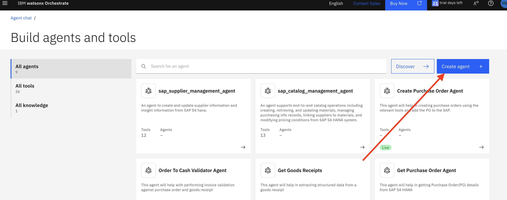

2. We will be building thsi agent from Scratch, therefore enter the provided name and description to the agent.

    - **Name:** 
    ```
    Sourcing Potential Supplier Agent
    ```
    - **Description:** 
    ```
    An agent to manage suppliers in SAP S4 HANA procurement system and perform Supplier Risk Analysis.
    ```
    Once you are done entering the above details click **Create**
    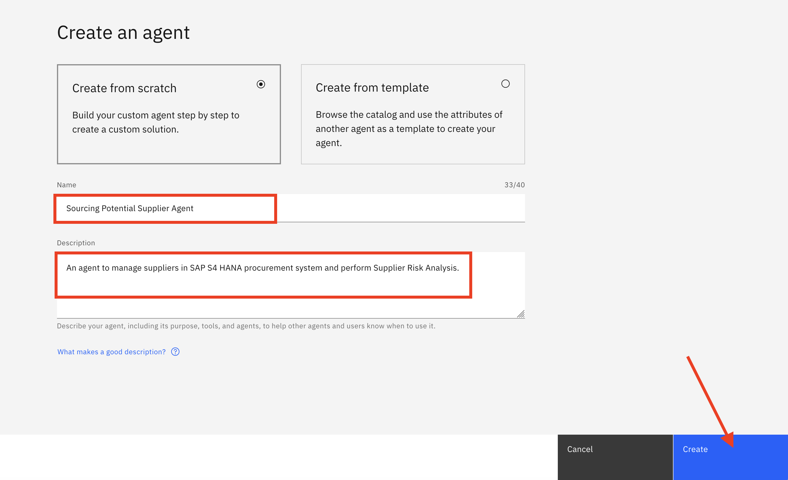

On the next screen, you can configure additional details about your agent.

3. You can select the **Large Language Model** the agent uses and the **style**. For this agent, select **GPT-OSS 120B** and the agent style as **Default**.
 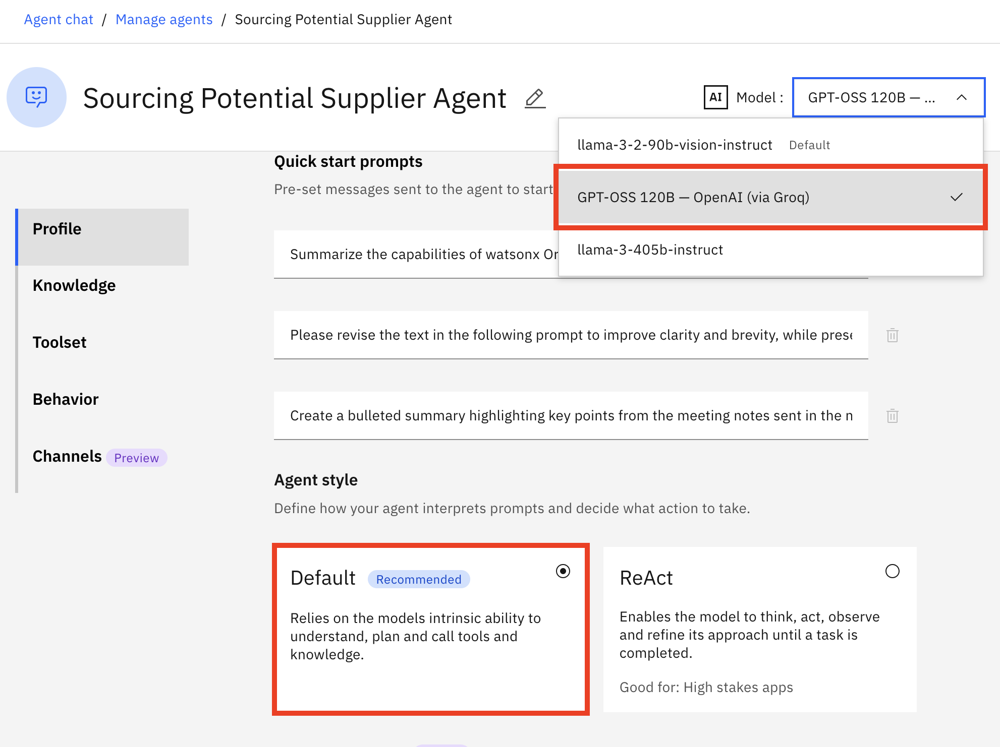

[← Back to Table of contents](#table-of-contents)
</details>

<details open id="adding-collab-agents">
<summary><h3>3.3.2 Adding Collaborator Agents</h3></summary>

We will now be adding the above two agents we had previously created as collaborator agent to this master agent

1. Scroll down to the toolset section or click on the **Toolset** option and click on **Add Agent +** button.
    

2. Choose the **Local Instance** option
    

3. Select the two child agents we had created before
    - **sap_catalog_management_agent**
    - **sap_supplier_management_agent**

    Click on **Add to agent**
    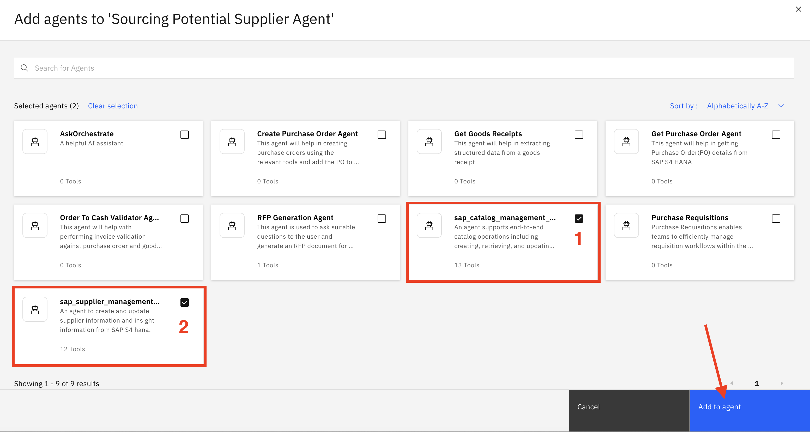

    You should now be able to see the two agents appear in the main agent page
    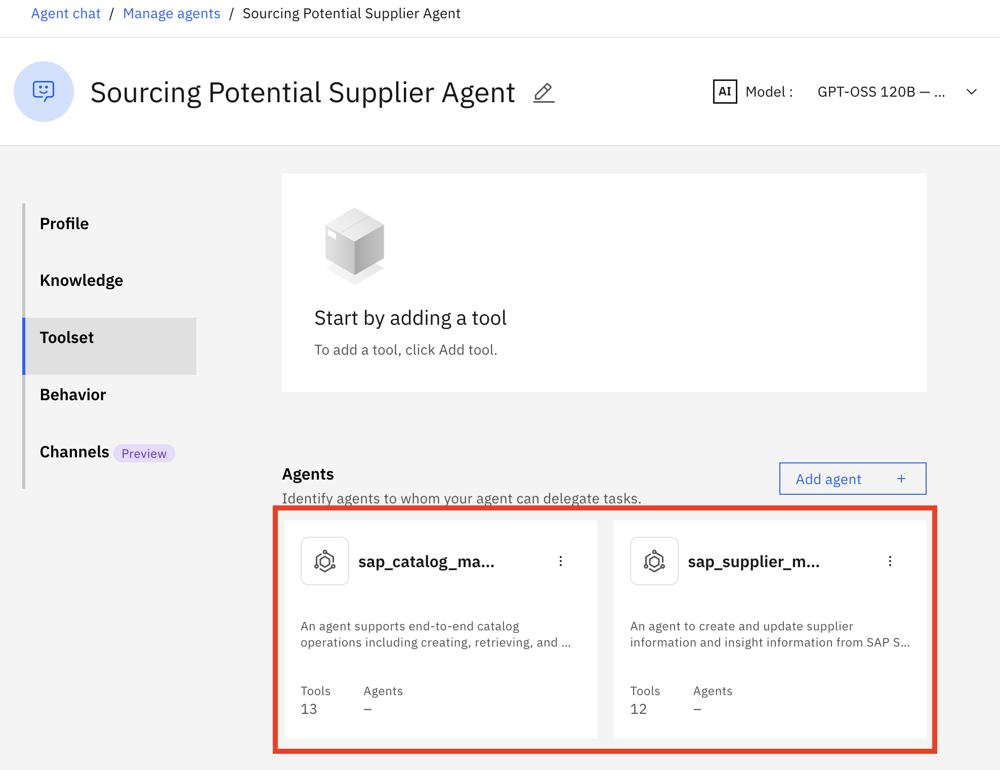

[← Back to Table of contents](#table-of-contents)
</details>

<details open id="adding-behavior">
<summary><h3>3.3.3 Adding Behvior to the Agent</h3></summary>

**Behavior** defines the instructions that the agent should follow while performing a particular task. It is the most important section since this is where we prompt the agent on what needs to be done. Always keep in mind to keep the behavior as precise and specific as possible.

1. Click **Behavior** on the left menu or scroll down to the Behavior section and enter the below provided content in the **Instructions** field.

```
**How To Route To Other Agents**
You are a manager agent. You have other agents working under you.
- When the users ask about available suppliers or wants to edit information (addresses, contact information, supplier details, etc.) for suppliers within the SAP S4 HANA procurement system use the sap_supplier_management_agent.
- When the users ask about inventory items or materials, purchasing info records, or pricing conditions (such as creating, updating, or retrieving), and if user wants to get/list suppliers for a specific material, use the sap_catalog_management_agent to handle these requests.
Your job is to delegate tasks to the most appropriate agent.

Do not prompt to generate Purchase Order, instead, asks to generate Request For Information. Says, "In order to generate Purchase Order, it's recommended that you go through the Request For Information Process."

Finally, suggest other options that you can do.

Always end with asking if they want to start Request For Information Process
```

  

[← Back to Table of contents](#table-of-contents)
</details>

</details>

</details>


<details open id="testing-agent">
<summary><h2>4. Testing the agent</h2></summary>

Now we are all set to test our agent, to do so let start by chatting in the preview tab shown on the right screen of the Agent.

1. Begin the conversation by asking as below.

```
Search for all suppliers that sells picoScan100 lidar
```

2. When we click on the individual steps we can see the observability of what is happening in the background and as you can see it is invoking the **sap_catalog_management_agent** which inturn invokes the tools integrated to it in the subsequent steps.
 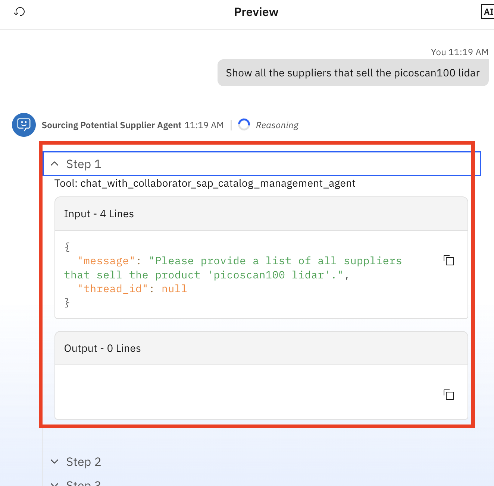

3. You should finally be able to see a response as below which lists out the suppliers for the picoscan100 lidar.
 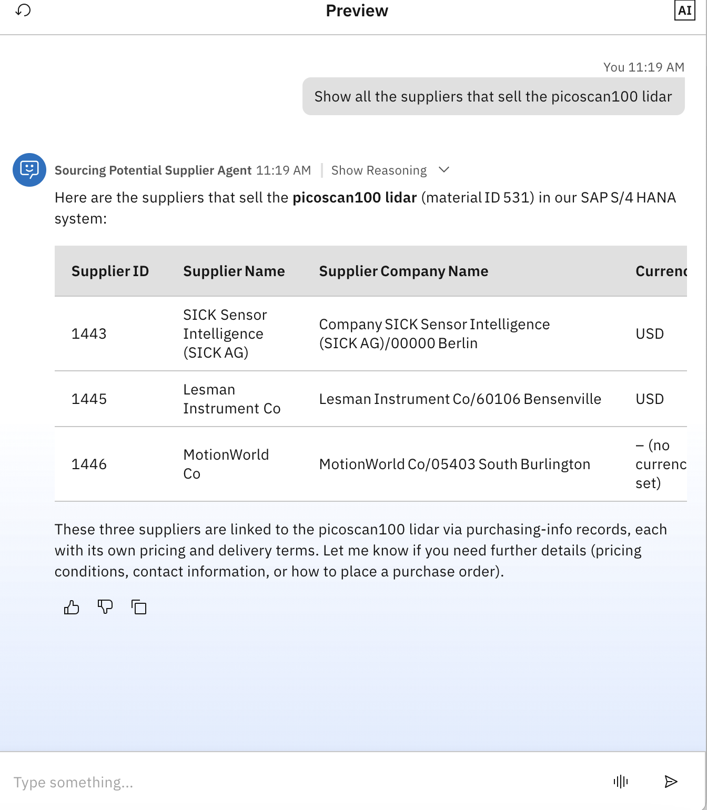

4. Let us now try to get some reasoning and ask the agent to select the most appropriate supplier, enter the below question in the chat window.
```
Which supplier has the lower price point?
```
 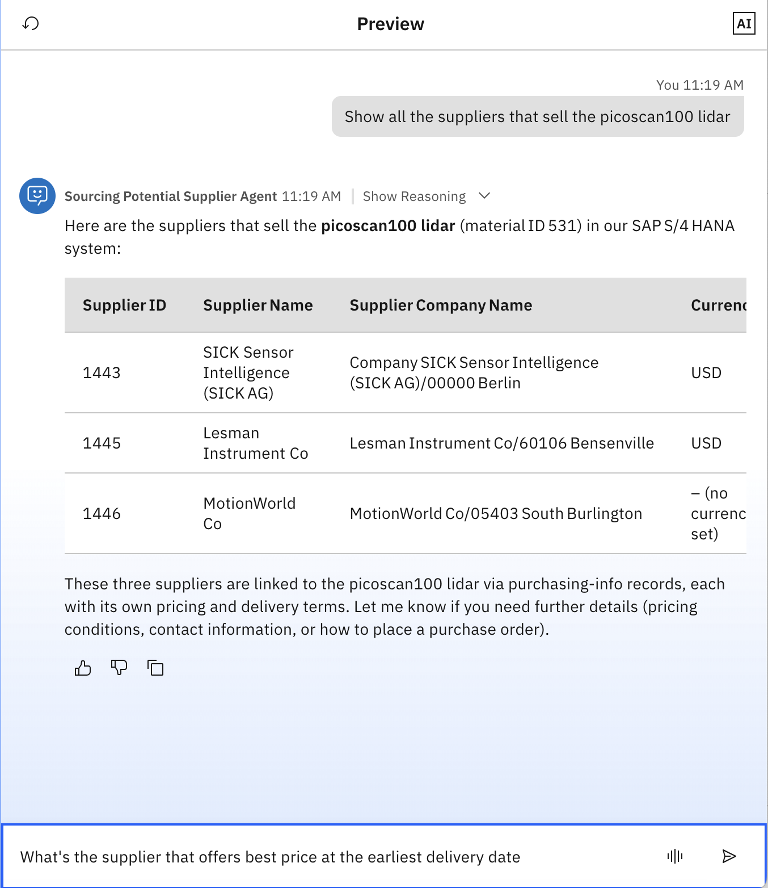

5. Let us try adding more contraints to the query
```
What about supplier that has lower price point AND fastest delivery day?
```

6. You can now see the agent has chosen the supplier 1446 as the best supplier based on the provided contraints.
 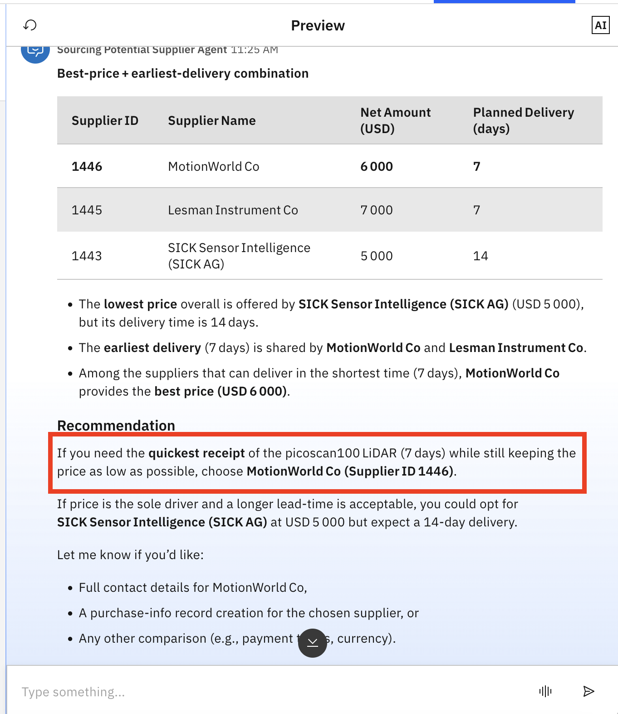

7. Let us now try to gather more information about this supplier, try the below question
```
Tell me more about the supplier 1446
```

8. You can now see that the **sap_supplier_management_agent** is being invoked since this provides information related to the suppliers
 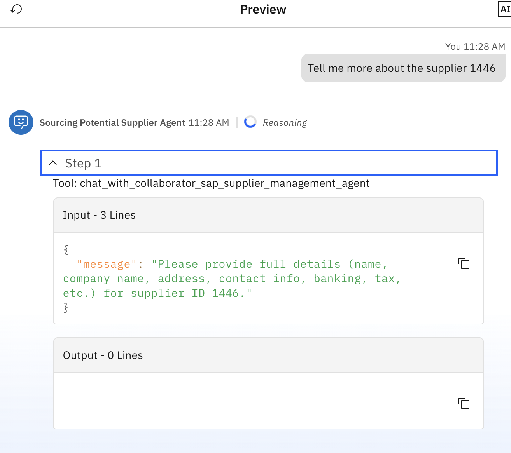

9. You can now finally see a detailed response for the supplier 1446.
 

[← Back to Table of contents](#table-of-contents)
</details>


<details open id="deploying-agent">
<summary><h2>5. Deploying the Agent (Optional)</h2></summary>

In this section, we will deploy the Sourcing Potential Supplier Agent along with the child agents created earlier. Deployment ensures that the agents are accessible through watsonx Orchestrate chat and ready to handle real-time queries.

To deploy the Agent 

1. Turn on the toggle button for Home page so that your agent shows up in the watsonx Orchestrate Chat home page, once deployed.

  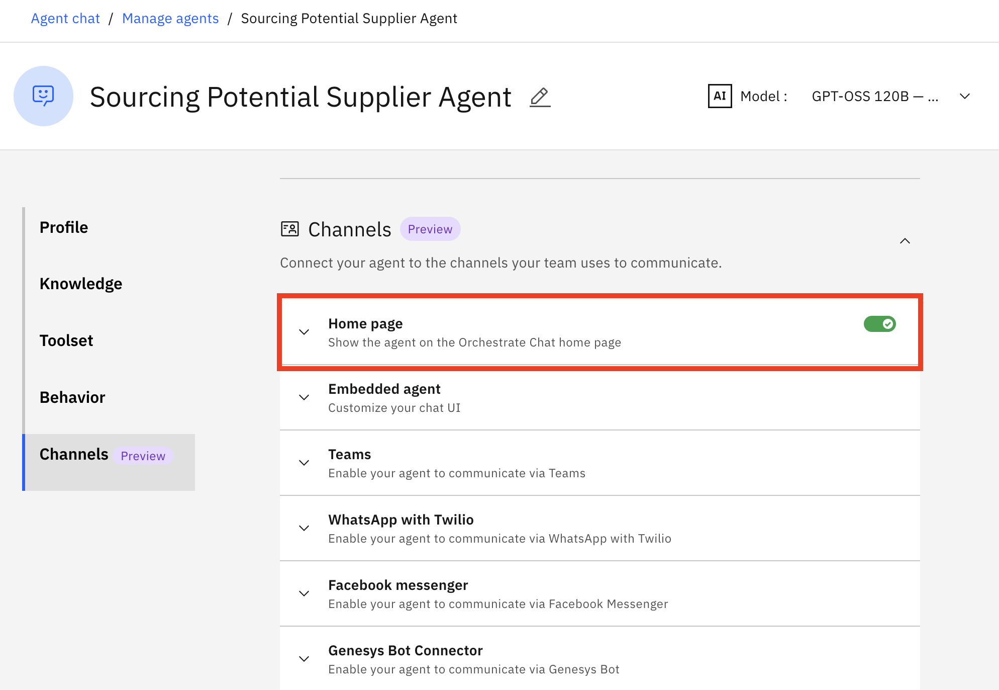

2. Click the **Deploy** button in the top-right corner to deploy your agent.

  

3. Click the **Deploy** button in the bottom-right corner of Pre-deployment summary page.

  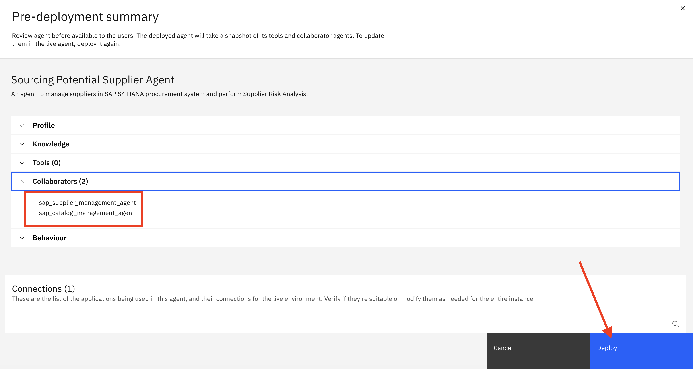

It make take a few seconds to complete the deployement process

4. To test the agent from the AI Chat window, click on the **☰** hamburger menu in the top left corner and then click on Chat.

  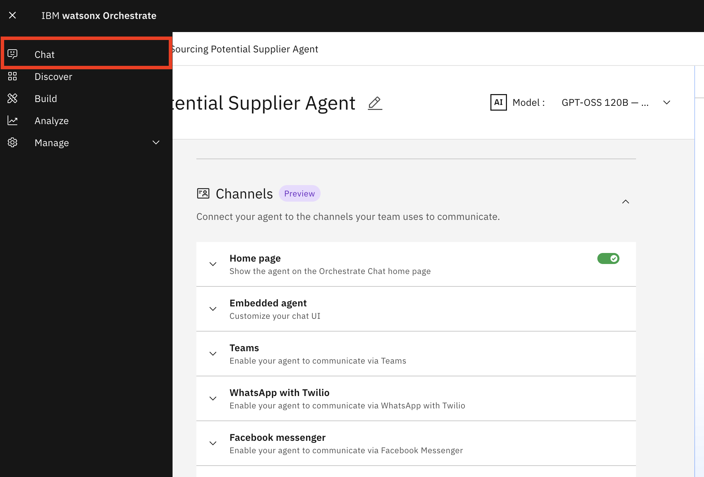

5. Make sure your **Sourcing Potential Supplier Agent** is selected in the dropdown. You can now test your agent.

  

[← Back to Table of contents](#table-of-contents) 

</details>


<details open id="summary">
<summary><h2>6. Summary</h2></summary>

In this lab, we successfully built an AI-powered agent in watsonx Orchestrate designed to automate the process of sourcing potential suppliers. The agent was configured to integrate with **SAP S4 HANA** using pre-built agents, retrieve supplier and catalog data, and apply decision logic to recommend the most suitable supplier based on cost and delivery time.

Throughout the lab, we accomplished the following key learning objectives:

* Created a master agent in watsonx Orchestrate to manage procurement workflows.
* Integrated two pre-built collaborator agents:
  * **Catalog Management Agent** for material and pricing details.
  * **Supplier Management Agent** for supplier insights and contact information.
* Added behavior instructions to enable intelligent task routing between agents.
* Tested the agent’s ability to:
  * List suppliers for a given product.
  * Identify the best supplier based on defined constraints.
  * Provide detailed supplier information on demand.
* Optionally deployed the agent for real-time interaction through the watsonx Orchestrate chat interface.

By completing this lab, you have gained hands-on experience in building multi-agent solutions that enhance procurement efficiency, reduce manual effort, and enable data-driven decision-making.

[← Back to Table of contents](#table-of-contents) | [← Back to Main Page](../../README.md) | [Next: Lab 2 - RFP Generation →](../Lab%202%20-%20RFP%20Generation/README.md)
</details>