# Lab 2 : Solicit Bids (RFP generation)

## Table of Contents
- [1. Introduction](#introduction)
- [2. RFP Generation Agent](#rfp-generation-agent)
    - [2.1 Creating the Agent](#creating-the-agent)
    - [2.2 Adding Knowledge Base to the agent](#adding-knowledge-base)
    - [2.3 Adding tools to the agent](#adding-tools)
    - [2.4 Adding Behavior to the agent](#adding-behavior)
- [3. Testing the agent](#testing-agent)
- [4. Deploying the Agent (Optional)](#deploying-agent)
- [5. Summary](#summary)


## Downloadables

Ensure you download these below files and keep them handy since we will be using them as part of the lab.

1. [RFP_Template.docx](<documents/RFP_Template.docx>)
2. [Generate-word-document-openapi.json](<documents/Generate-word-document-openapi.json>)

<details open id="introduction">
<summary><h2>1. Introduction</h2></summary>

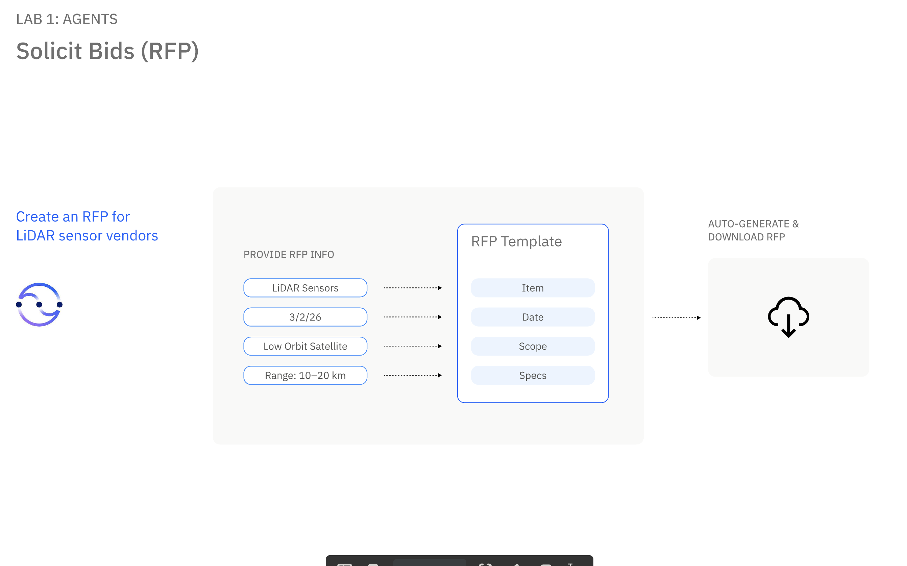

This lab focuses on automating the creation of Request for Proposal (RFP) documents using watsonx Orchestrate. The goal is to streamline procurement processes by leveraging AI-driven automation.

The specific scenario involves generating an RFP for LiDAR systems used in low-orbit satellites. These RFPs are critical for sourcing advanced LiDAR technology that meets stringent requirements for satellite operations.

In this lab, you will build an AI-powered agent within watsonx Orchestrate that:

* Adheres to a predefined RFP template.
* Interacts with the user by asking key questions to gather necessary details.
* Automatically compiles the collected information into a structured RFP document.
* Provides the option to download the final document in Microsoft Word (.docx) format.

By automating RFP generation, procurement teams can:

* Reduce manual effort and time spent on document preparation.
* Ensure consistency and accuracy across all RFPs.
* Improve efficiency and accelerate vendor engagement.

[← Back to Table of contents](#table-of-contents) 
</details>

<details open id="rfp-generation-agent">
<summary><h2>2. RFP Generation Agent</h2></summary>

We are now ready to get started with building the RFP Generation Agent. Since you are familiar with the UI of watsonx Orchestrate from your previous lab session, let us get straight into building the agent.

<details open id="creating-the-agent">
<summary><h3>2.1 Creating the Agent</h3></summary>

1. Go to the Manage Agents/Build Agents tab by clicking on the `Build` option as shown below and click on Create Agent.
 
    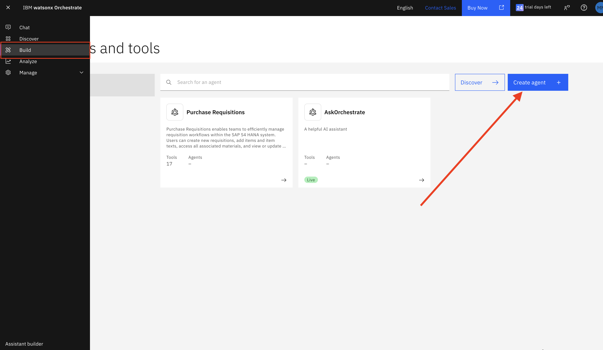

2. Enter the requested fields with the below provided content.
  - **Name:** This describes the name of the Agent.
    ```
    RFP Generation Agent
    ```

  - **Description:** This describes what tasks the agent will be performing, this will be useful when we are building a multi agentic solution when agents needs to discover suitable agents based on the task in hand.
    ```
    This agent is used to ask suitable questions to the user and generate an RFP document for LiDAR used on low-orbit satellites
    ```
    Once you are done entering the above details click **Create**
    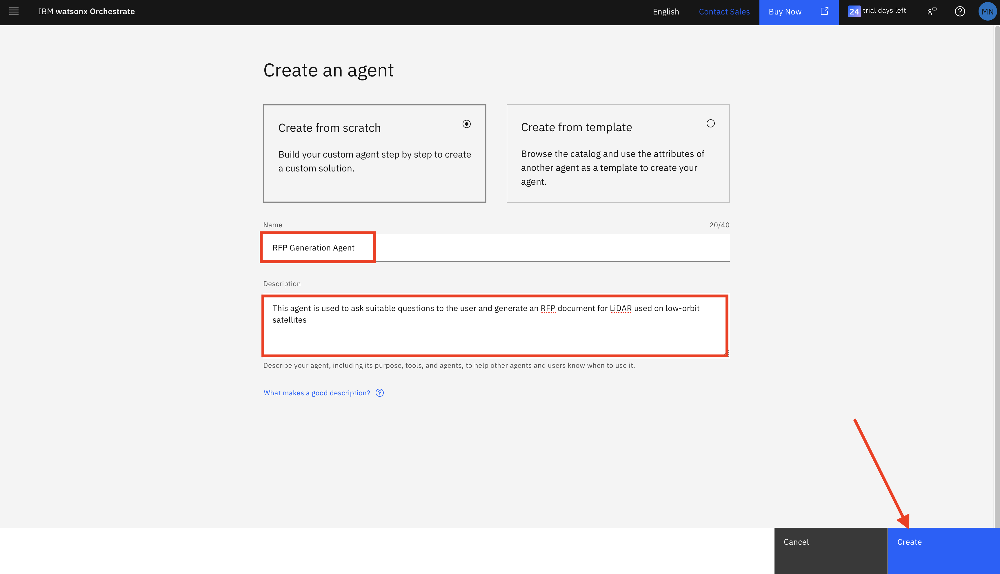

On the next screen, you can configure additional details about your agent.

3. You can select the **Large Language Model** the agent uses and the **style**. For this agent, select **GPT-OSS 120B** and the agent style as **Default**.
    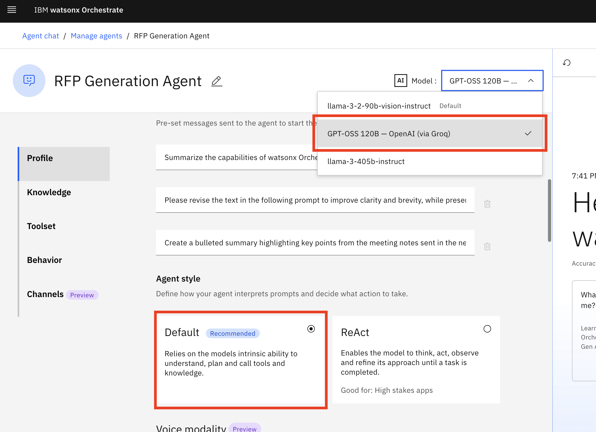

[← Back to Table of contents](#table-of-contents) 
</details>

<details open id="adding-knowledge-base">
<summary><h3>2.2 Adding Knowledge Base to the agent</h3></summary>

**Knowledge** represents information stored as embeddings in a Vector Store. When the agent receives a request, it can search the connected knowledge repository to find relevant information. You can upload documents or link to an existing repository

In our scenario we will be uploading the RFP template as knowledge so that the Agent can adhere to the template while generating the RFP documents.

1. Click **Knowledge** on the left menu or scroll down to the Knowledge section, then click **Add source +**.
 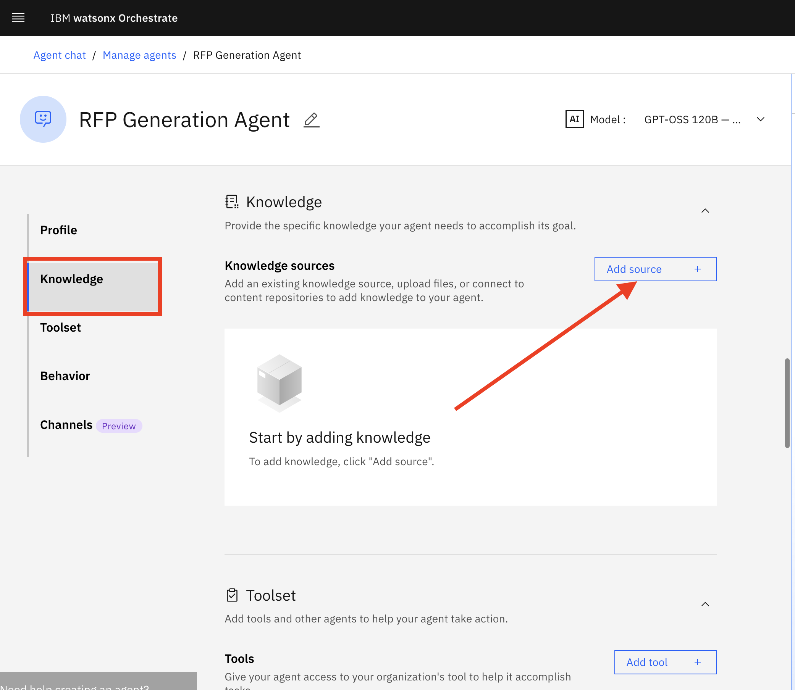

2. Select **New knowledge**
 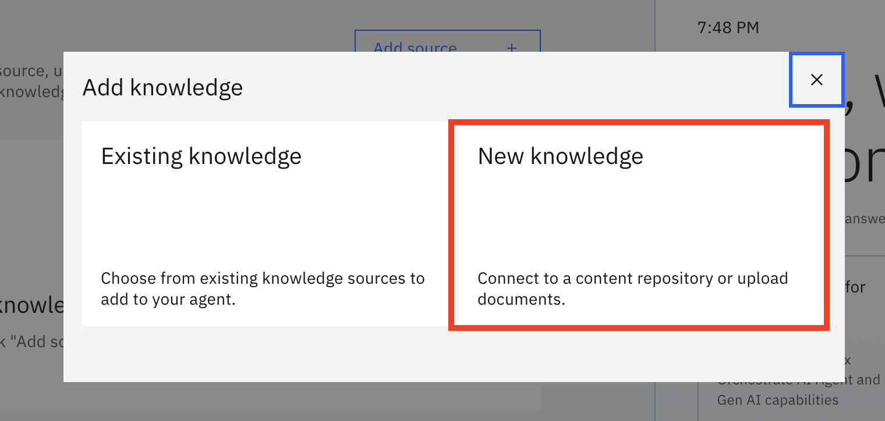

3. Since we will be uploading the file from local, select the **Upload files** option and click **Next**.
 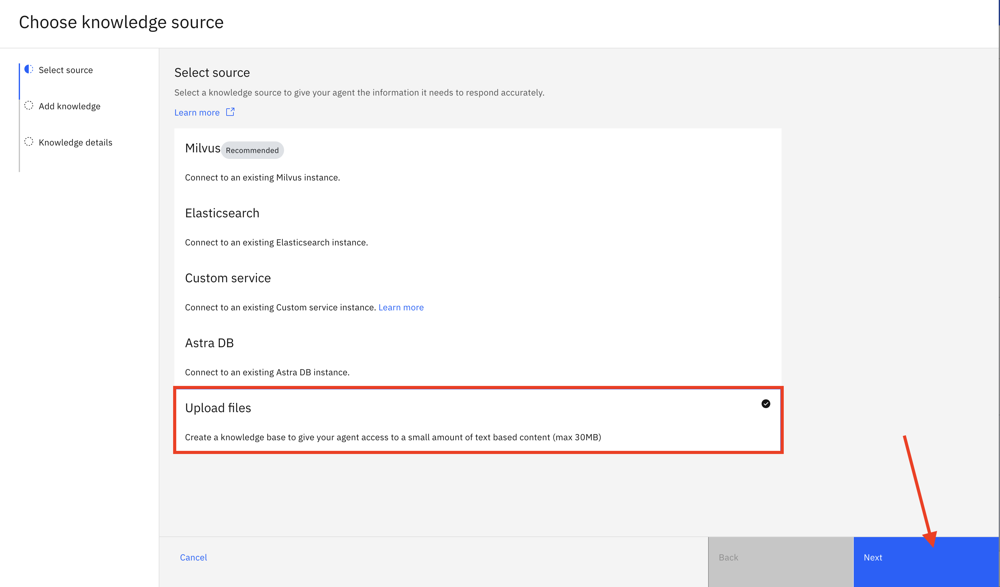

4. Click **Drag and drop files here or click to upload**. Upload the previously downloaded file [RFP_Template.docx](<documents/RFP_Template.docx>) and click **Next**.
 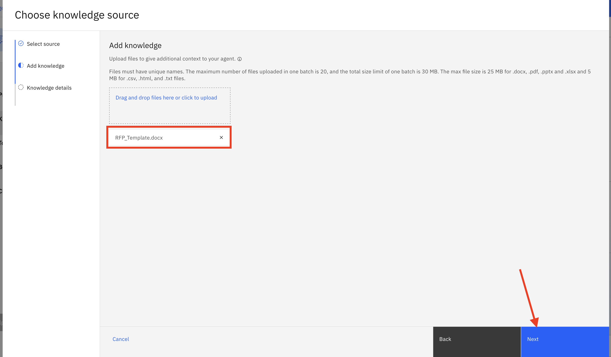

5. Provide the below details for the requested fields and click save.
  - **Name**
    ```
    RFP document template
    ```
  - **Description**
    ```
    This document contains a basic template on what all fields are required to build an RFP document for LiDAR used on low-orbit satellites.
    ```
    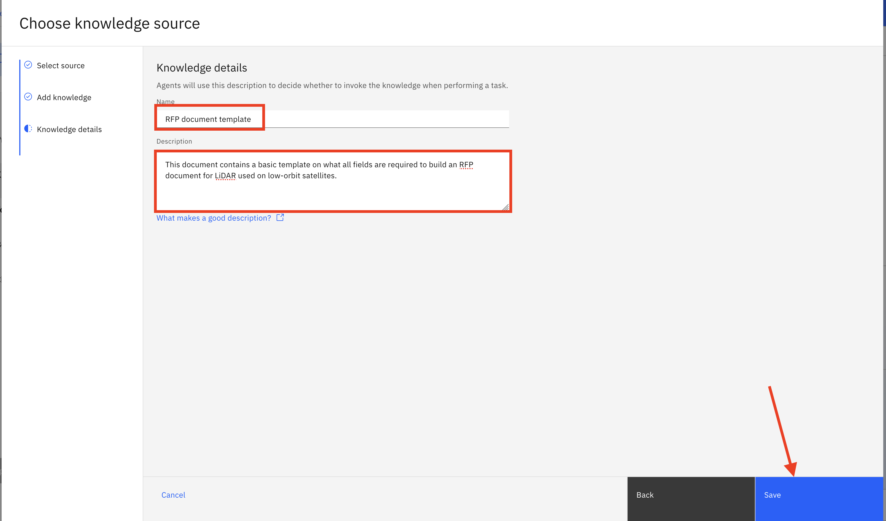

[← Back to Table of contents](#table-of-contents) 
</details>

<details open id="adding-tools">
<summary><h3>2.3 Adding tools to the agent</h3></summary>

Since we will be generating an RFP document, inorder to download this document in Word Format we need a custom tool. In this section we will walking over the process on creating this custom tool.

1. Click **Toolset** on the left menu or scroll down to the Toolset section, then click **Add tool +**.
 

2. Select the **OpenAPI** option.
 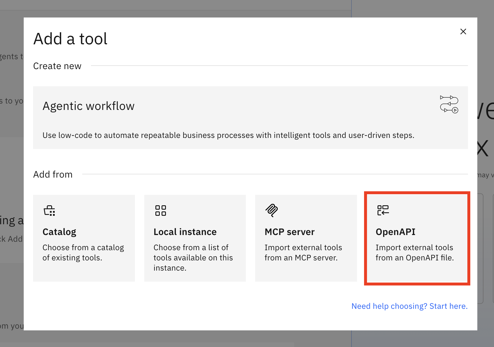

3. Click **Drag and drop files here or click to upload**. Upload the previously downloaded file [Generate-word-document-openapi.json](<documents/Generate-word-document-openapi.json>) and click **Next**.
 

4. The next page gives you details about the tool such as description. Click on the checkbox to select the operation and click **Done**
 

[← Back to Table of contents](#table-of-contents) 
</details>

<details open id="adding-behavior">
<summary><h3>2.4 Adding Behavior to the agent</h3></summary>

**Behavior** defines the instructions that the agent should follow while performing a particular task. It is the most important section since this is where we prompt the agent on what needs to be done. Always keep in mind to keep the behavior as precise and specific as possible.

1. Click **Behavior** on the left menu or scroll down to the Behavior section and enter the below provided content in the **Instructions** field.
    ```
    You are an RFP generation agent for Amazon Procurement team.
    Your job is to ask the user one single question per section, collect minimal inputs, and then automatically generate a simple 2–3 page RFP for a Low-Orbit Satellite LiDAR Survey.

    All other details must be completed by you using standard, generic, professionally acceptable text.

    Knowledge base : You are provided with a template of a sample RFP document and the fields that needs to be filled up are also mentioned in the document, your final output should be a similar document.

    ✅ ASK ONLY THESE BELOW QUESTIONS (ONE PER SECTION)

    1. Background & Objective
    Question 1:
    “Please describe briefly (2–3 sentences) why you need this LiDAR survey.”
    (Everything else about background will be auto-filled.)

    2. Scope of Work
    Question 2:
    “What is the approximate area to be surveyed (example: 50 sq km, 100 hectares, etc.)?”
    (You will auto-fill DEM/DSM, orthomosaic, point-cloud, etc.)

    3. Project Timeline
    Question 3:
    “What is your expected issue date and the submission deadline date”

    4. Proposal Requirements
    Question 4:
    “What documents must vendors submit? (Company profile, past experience, methodology, timeline, financials, etc.)”
    (Auto generate the remaining content based on the template)

    5. Financial Proposal Format
    Question 5:
    “Do you want a lump-sum cost or cost per hectare/sq km?”
    (Create an empty table with placeholders to fill up the details)

    6. Submission Details
    Question 6:
    “How should vendors submit the proposal? (Email / Portal / PDF upload)”
    (You will auto-fill contact information and instructions.)

    Once the user answers the 6 questions, the agent must respond:
    “I have all required inputs. Shall I generate the RFP document now?”
    When the user confirms, generate the final 2–3 page RFP document in the same format as the provided template 
    Ensure the below instructions are followed
    - Clean formatting
    - Professional structure
    - All missing content auto-filled
    - No oversized sections
    - Ready-to-present output

    ✅ RFP STRUCTURE YOU MUST GENERATE

    1. RFP Summary Details (Include only the below 3 fields and DO NOT show in a table)
    - RFP Title
    - RFP Number
    -  Issue Date
    2. Background & Objective
    3. Scope of Work (in a table)
    4. Project Timeline (in a table)
    5. Proposal / Vendor Requirements
    6. Terms & Conditions 
    7. Evaluation Overview (in a table)
    8. Financial Proposal Format (in a table)
    9. Submission Instructions

    ✅ RULES

    - Ask only the questions listed above.
    - Ask all these questions at once and wait for the user to enter them all at once. If any item is missing ask them before moving forward with creating the RFP.
    - Do not ask for multiple clarifications unless absolutely necessary.
    - Auto-fill everything else with professionally acceptable content.
    - Keep final RFP within 2–3 pages.
    - Display the complete RFP document generated to the user.

    Once you display the RFP document to the user, Ask the user if they wish to get a downloadable Word File.
    If the User responds Yes
    -> Invoke the tool `generate_word_document` by passing the entire generated RFP document in a markdown fashion.
    -> The tool will return a downloadable URL to the document, display it back to the user.

    ✅ RULES
    - Ensure you send the complete RFP document to the tool and only in markdown format.
    - Display the link in markdown format with a meaningful name
    ```
    

 [← Back to Table of contents](#table-of-contents) 
</details>

</details>

<details open id="testing-agent">
<summary><h2>3. Testing the agent</h2></summary>

Now we are all set to test our agent, to do so let start by chatting in the preview tab shown on the right screen of the Agent.

1. Begin the conversation by asking as below.
    ```
    I want to generate an RFP document for LiDAR used on low-orbit satellites
    ```
    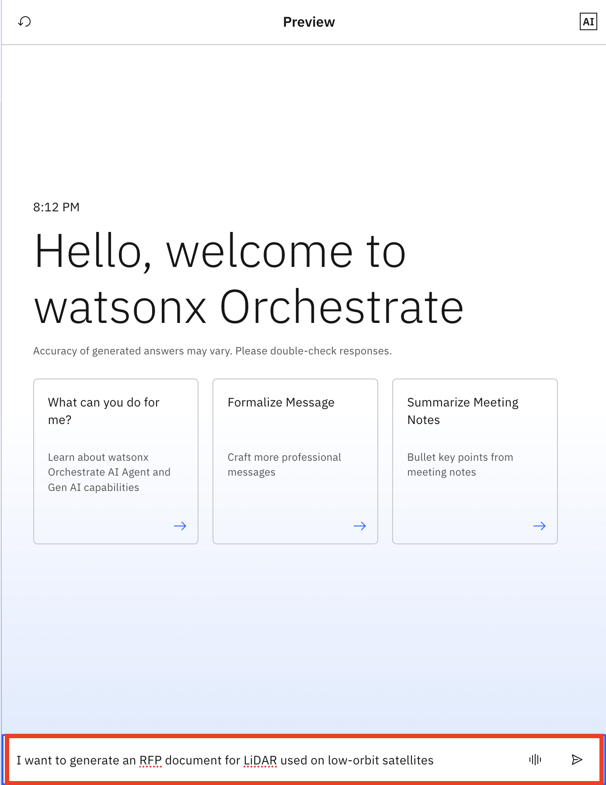


2. The agent will list out all the required questiosn to be answered which is essential for creating the RFP. Enter the below details.
    ```
    1. This LiDAR survey from low-orbit satellites will help us monitor vegetation structure, canopy height, and terrain variations across remote forest areas. Satellite LiDAR enables rapid mapping of large zones that are otherwise difficult to access. The data will support ecological analysis and conservation planning. 

    2. 80 hectares 

    3. Issue date : 12th December 2025 
    Deadline : 25th December 2025 

    4. Company profile, past experience, methodology, timeline 

    5. Cost per hectare. 

    6. Via email
    ```
    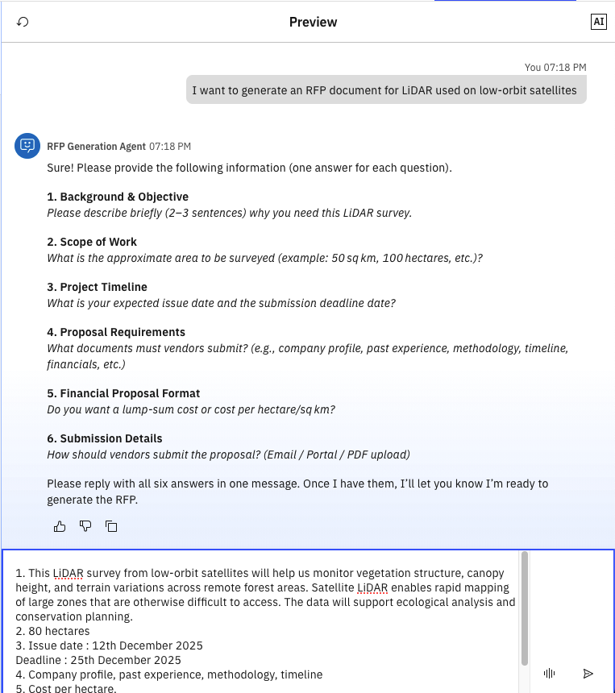


3. Now the agent has collected all the required details and asks for confirmation to generate the RFP document, you can enter `Yes`.
    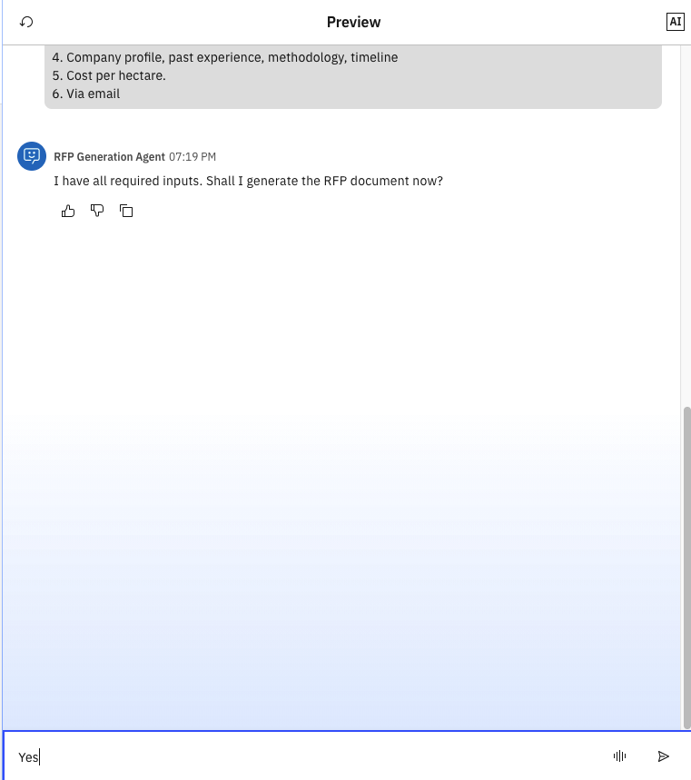

4. The agent will now stream out the complete RFP document in a few seconds and you should be able to see a clearly structured RFP document as shown below.
    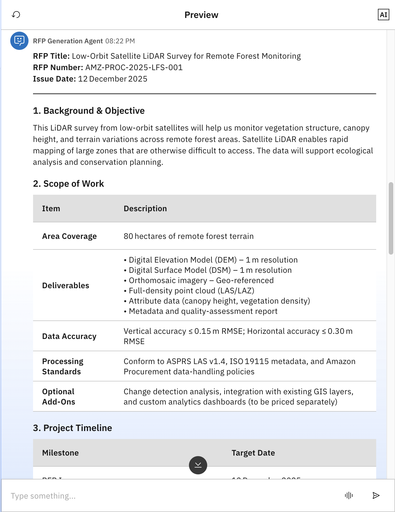

5. If we scroll to the end of the document, the agent will ask if we need a downloadable word version to the RFP, we can respond saying
    ```
    Yes I want a downloadable word document
    ```
    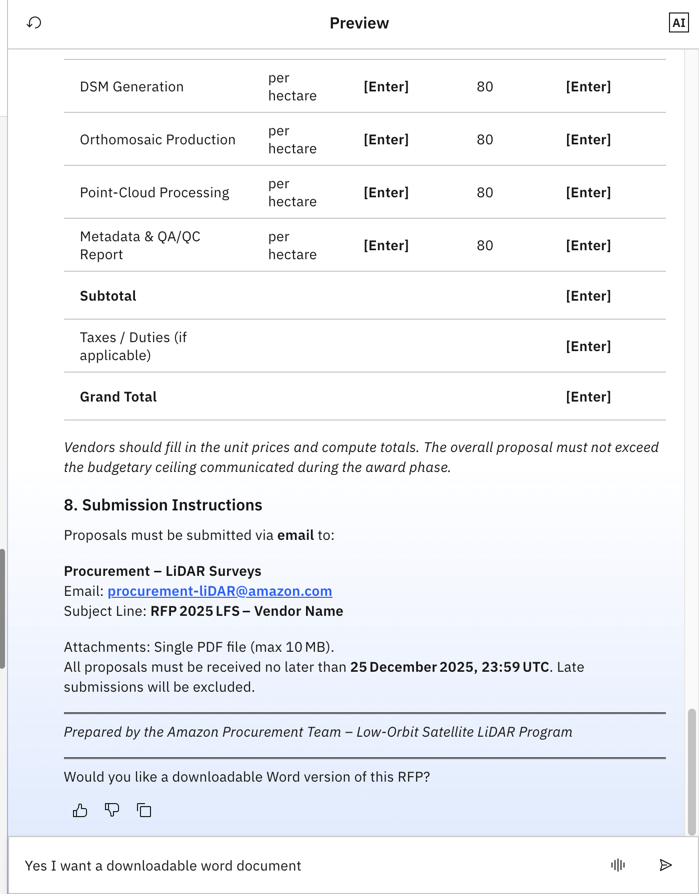

6. You can now see a downloadable link to the word document. On clicking it, the download process of the document should begin.
    

7. When we click on **Show Reasoning** and expand the **Step 1** we can see that the agent has invoked the tool we had added to generate this downloadable word document.
    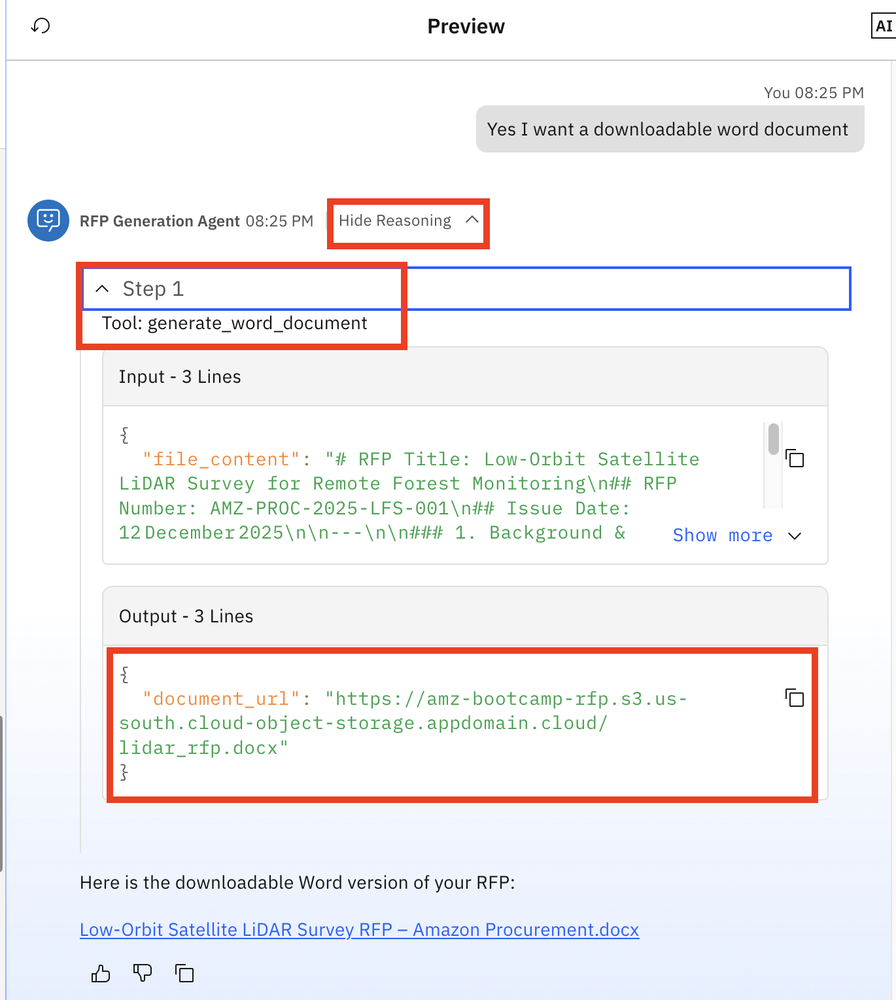

8. You can preview the content of the Word document which you just downloaded. It should be same as the one you saw on the chat window.

</details>

<details open id="deploying-agent">
<summary><h2>4. Deploying the Agent (Optional)</h2></summary>

In this section, we will deploy the RFP Generation Agent along with the tool created earlier. Deployment ensures that the agents are accessible through watsonx Orchestrate chat and ready to handle real-time queries.

To deploy the RFP Generation Agent 

1. Turn on the toggle button for Home page so that your agent shows up in the watsonx Orchestrate Chat home page, once deployed.

      

2. Click the **Deploy** button in the top-right corner to deploy your agent.

      

3. Click the **Deploy** button in the bottom-right corner of Pre-deployment summary page.

      

It make take a few seconds to complete the deployement process

4. To test the agent from the AI Chat window, click on the **☰** hamburger menu in the top left corner and then click on Chat.

      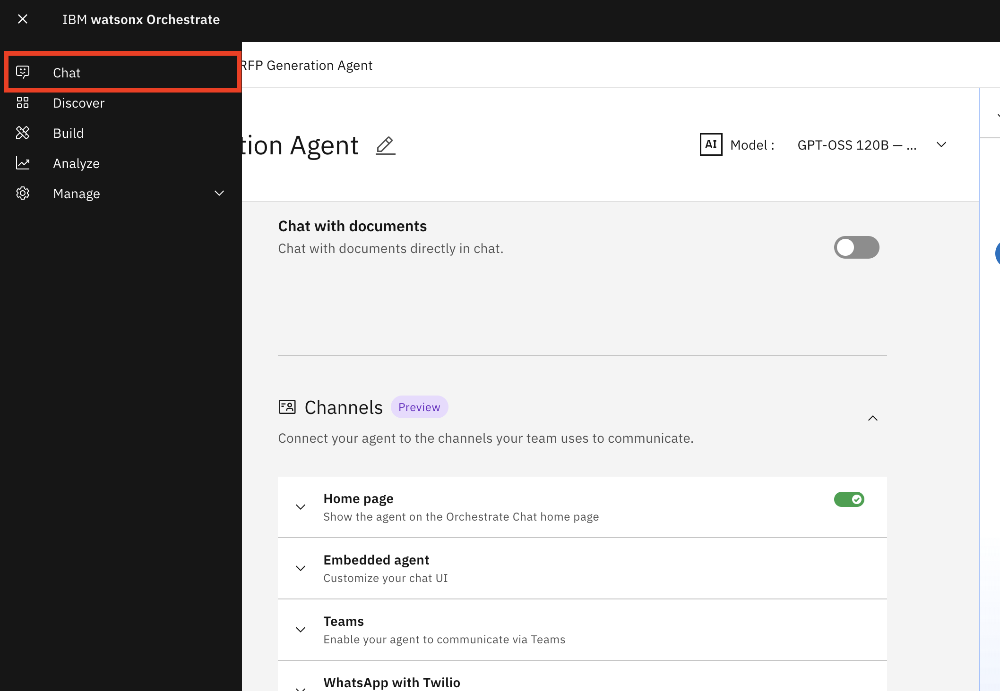

5. Make sure your RFP Generation Agent is selected in the dropdown. You can now test your agent.

      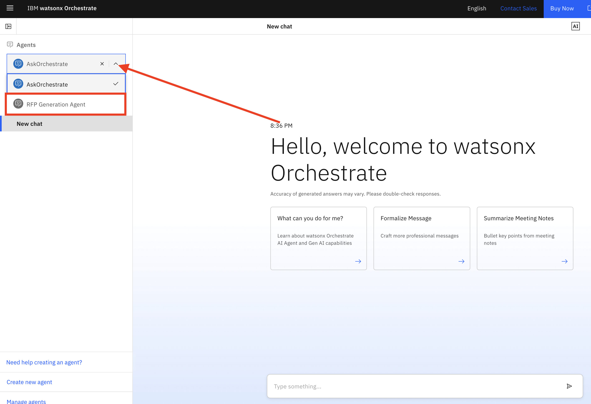

[← Back to Table of contents](#table-of-contents) 
</details>


<details open id="summary">
<summary><h2>5. Summary</h2></summary>

In this lab, we successfully built an AI-powered agent in watsonx Orchestrate designed to automate the generation of Request for Proposal (RFP) documents for LiDAR systems used in low-orbit satellites. The agent was configured to follow a predefined template, interact with users to collect essential details, and produce a downloadable RFP document in Microsoft Word (.docx) format.

Throughout the lab, we accomplished the following key learning objectives:

* Created a custom agent in watsonx Orchestrate tailored for procurement workflows.
* Integrated a tool into the agent to enable document generation capabilities.
* Added a knowledge base to the agent, ensuring it could reference it as the template for the RFP document.

By completing this lab, you have gained hands-on experience in building intelligent automation solutions that enhance efficiency, reduce manual effort, and deliver consistent results for business processes.

[← Back to Table of contents](#table-of-contents) | [← Back to Lab 1](../Lab%201%20-%20Sourcing%20Potential%20supplier/README.md) | [← Back to Main Page](../../README.md) | [Next: Lab 3 - Order to Cash →](../Lab%203%20-%20Order-to-Cash/README.md)
</details>