# Lab 3 : Order To Cash 

## Table of Contents 

- [1. Introduction](#introduction)
- [2. Creating Agents in watsonx Orchestrate](#creating-agents-in-watsonx-orchestrate)
  - [2.1 Create Purchase Order Agent](#create-purchase-order-agent)
  - [2.2 Create Get Purchase Order Agent](#create-get-purchase-order-agent)
  - [2.3 Create Get Goods Receipts Agent](#create-get-goods-receipts-agent)
  - [2.4 Creating Order To Cash Validator Agent](#creating-order-to-cash-validator-agent)
- [3. Testing of Agents](#testing-agents)
  - [3.1 Testing Create Purchase Order Agent](#testing-create-purchase-agent)
  - [3.2 Testing the Order To Cash Validator Agent](#testing-the-order-to-cash-validator-agent)
- [4. Summary](#summary)

<details open id="introduction">
<summary><h2>1. Introduction</h2></summary>

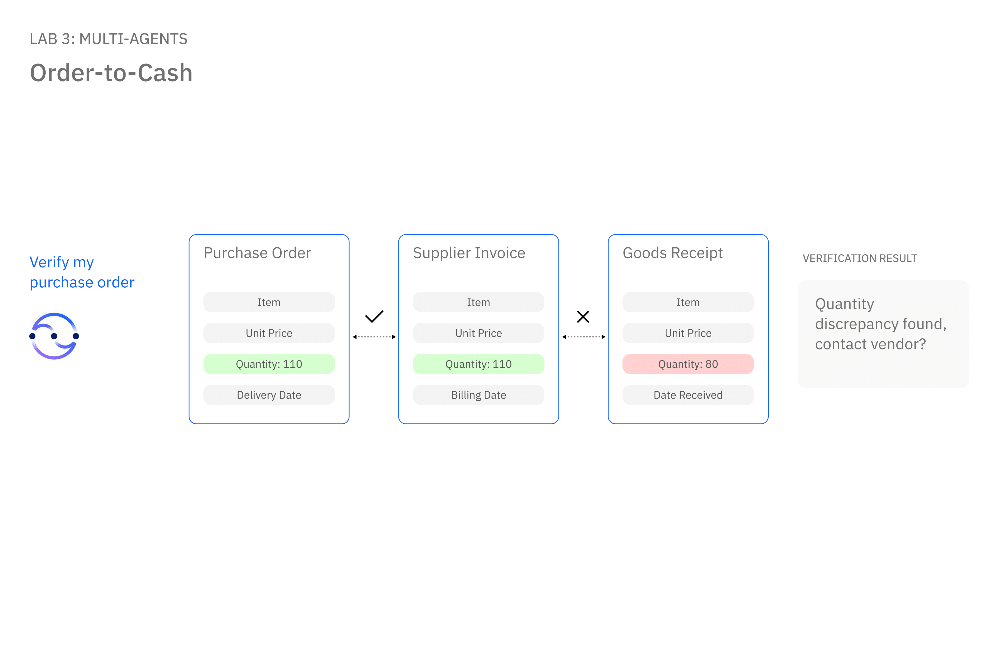

This lab focuses on automating the **Order to Cash (O2C)** process using watsonx Orchestrate. The goal is to streamline procurement and financial workflows by leveraging AI-driven agents that integrate with enterprise systems like **SAP S4HANA**.

The specific scenario involves performing a **three-way match** between **Purchase Order**, **Supplier Invoice**, and **Goods Receipt** to validate invoices and ensure compliance. This is a critical step in the O2C cycle for preventing payment errors and maintaining financial integrity.

We will build a multi-agent solution within watsonx Orchestrate that:

* Creates purchase orders and retrieves their details from SAP S/4HANA.
* Extracts goods receipt data and links it to the corresponding purchase order.
* Generates invoice data and performs strict three-way matching.
* Provides validation results with clear pass/fail status and failure reasons.

By automating the O2C validation process, procurement and finance teams can:

* Detect discrepancies early (e.g., quantity mismatches).
* Reduce manual effort and eliminate repetitive checks.
* Accelerate invoice processing and improve operational efficiency.

[← Back to Table of contents](#table-of-contents) 
</details>


<details open id="creating-agents-in-watsonx-orchestrate">
<summary><h2>2. Creating Agents in watsonx Orchestrate</h2></summary>

We will be creating 4 agents as part of this lab

1. **Create Purchase Order Agent:** Creates new purchase orders in SAP S/4HANA and returns the generated PO ID.
2. **Get Purchase Order Agent:** Retrieves detailed information for a given purchase order from SAP S/4HANA.
3. **Get Goods Recepit Agent:** Provides structured goods receipt data linked to a specified purchase order.
4. **Order To Cash Validator Agent:** Performs a strict three-way match between Purchase Order, Goods Receipt, and Invoice to validate accuracy and compliance.

<details open id="create-purchase-order-agent">
<summary><h3>2.1 Create Purchase Order Agent</h3></summary>

1. Click on **Create Agent +** from the **Manage Agents** tab

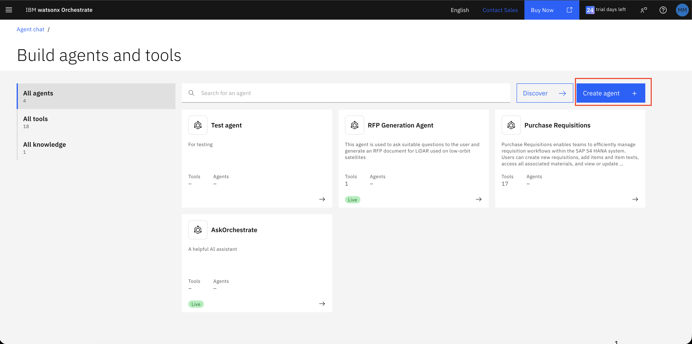

2. Give the **Name** and agent **Description**.
  
```
Create Purchase Order Agent
```

```
This agent will help in creating purchase orders using the relevant tools and add the PO to the SAP.
```

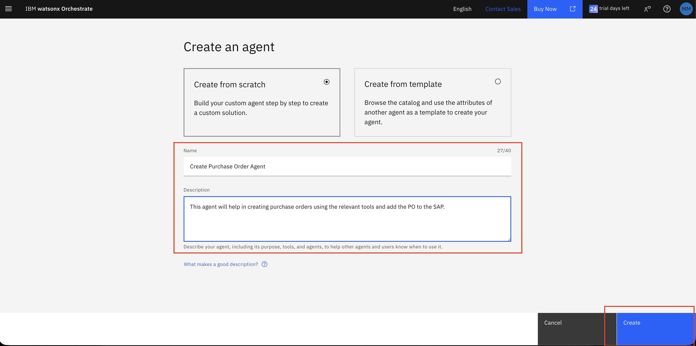

3. You can select the **Large Language Model** the agent uses. For this agent, select **llama-3-2-90b-vision**.


4. Edit the Welcome Message

```
Hello, I am the Create Purchase Order Agent.
```
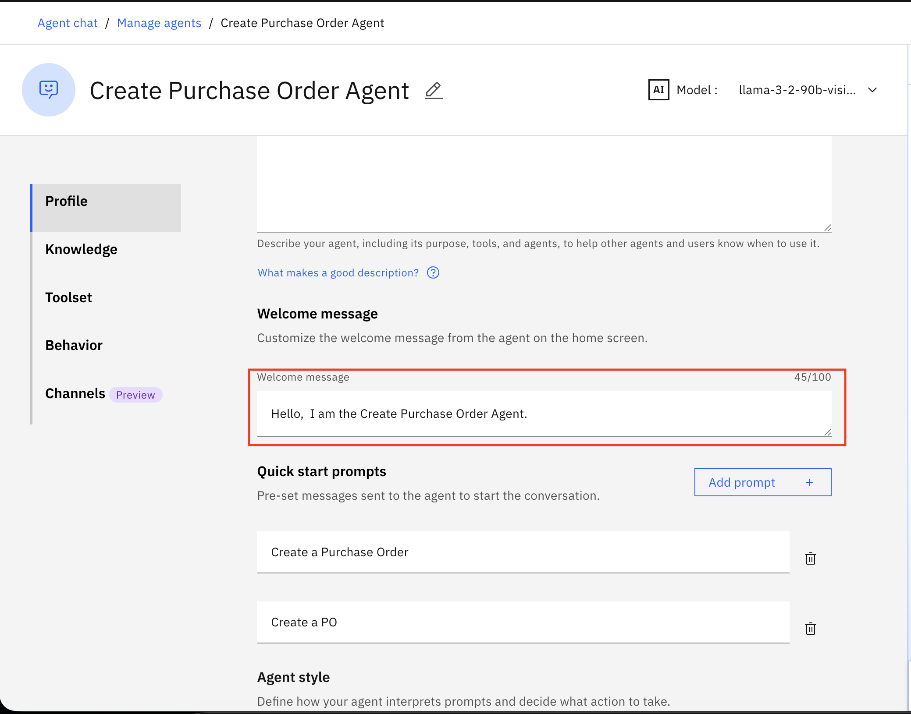

5. Edit the QuickStart Prompt to the following prompt below.

```
Create a Purchase Order
```
```
Create a PO
```

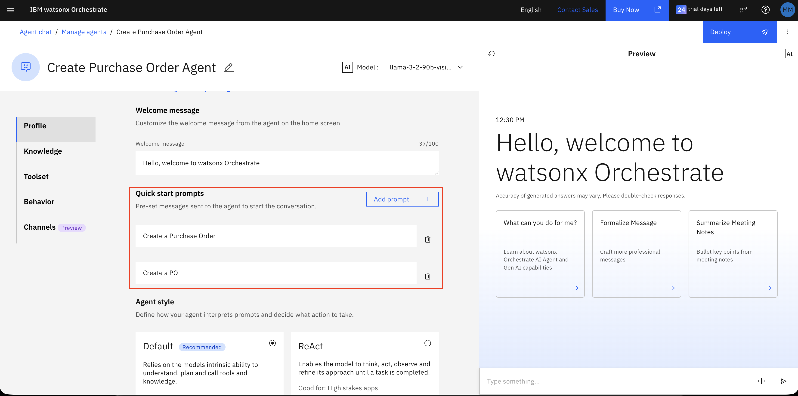

6. Keep the agent style and voice modality as it is.

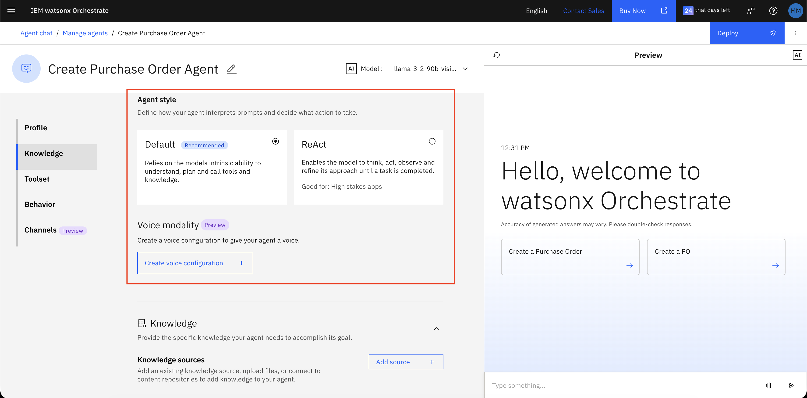

### Adding Tools to the agent

1. Click **Toolset** on the left menu or scroll down to the Toolset section, then click **Add tool +**.

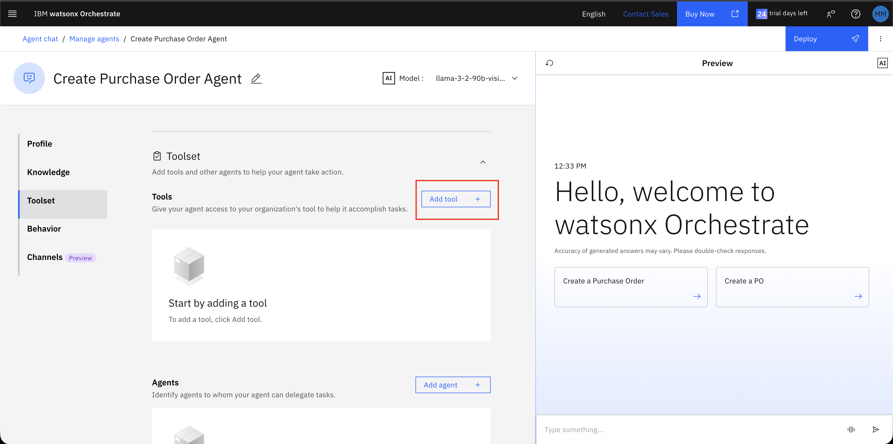

2. Select the **Catalog** option.

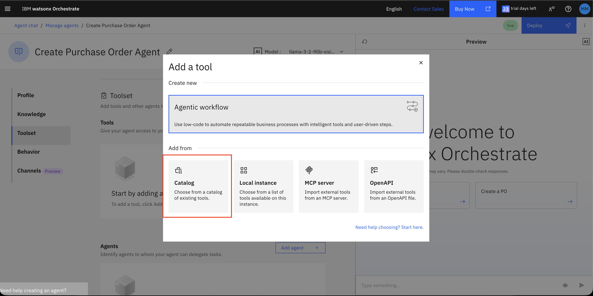

3. Search for ```SAP S4 HANA``` in the left panel of Apps Section. Search for the following in the top search bar.
    ```
    Create a purchase order in S4 HANA
    ```


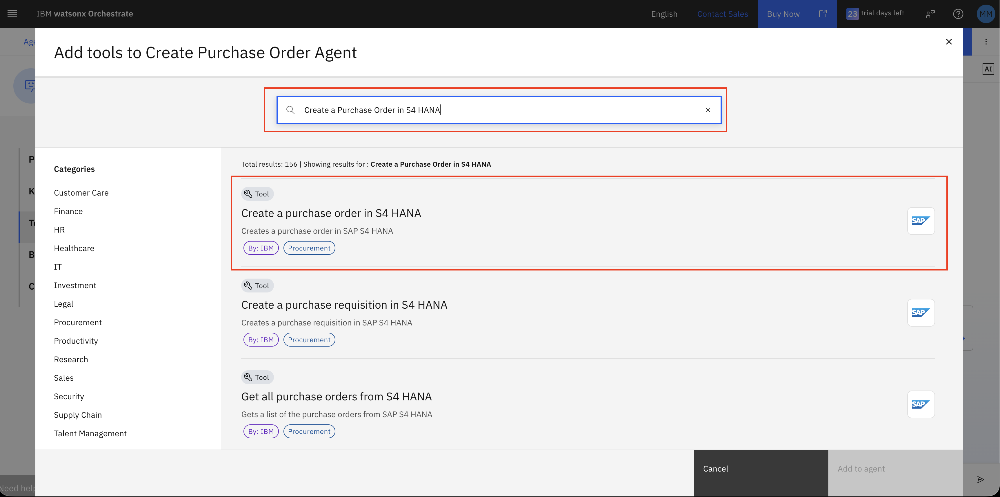

4. Click on **Add to agent**.

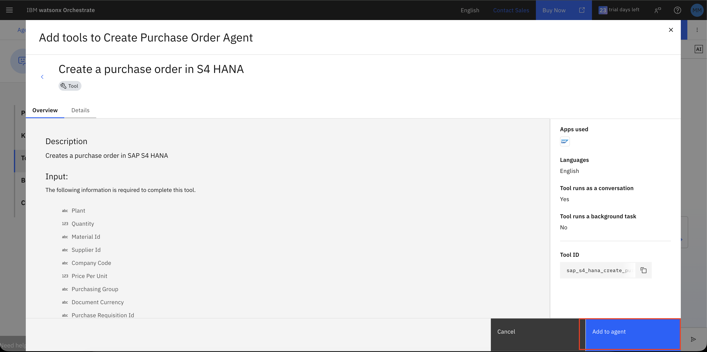

5. Click on **Add Tool** again. 
6. Search for ```SAP S4 HANA``` in the left panel of Apps Section.
  Search for the following in the top search bar.
    ```
    Get all suppliers in S4 HANA
    ```

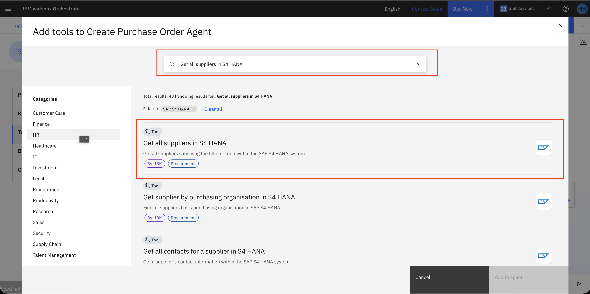

7. Click on **Add to agent**.


The tools are now successfully imported to the agent.

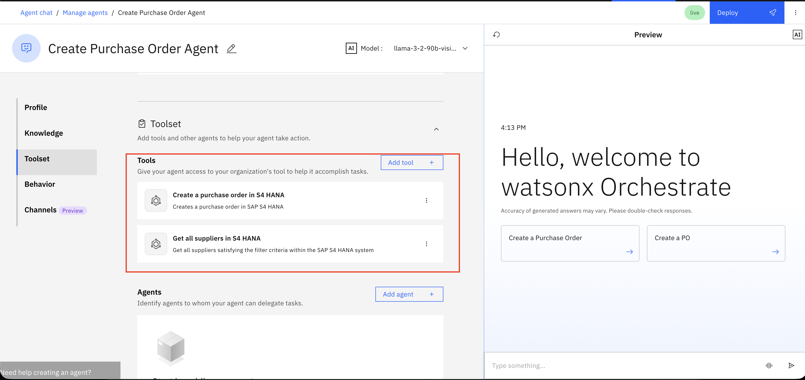

### Adding Behavior to the agent

1. Click **Behavior** on the left menu or scroll down to the Behavior section and enter the below provided content in the **Instructions** field.

```
**Role**
You are an agent in charge of creating Purchase Orders and updating it in SAP S4 HANA for Amazon Procurement team. You are helping a procurement manager in creating purchase orders in a SAP S4 HANA procurement system.

When asked to create a purchase order(PO)
-> Invoke `Create a purchase order in S4 HANA` tool. use the fixed test data provided below. Return only the purchase order ID from the tool response and handle errors gracefully.
{
        "supplier_id": "1072",
        "company_code": "WXO1",
        "purchasing_organization": "WXO1",
        "purchasing_group": "001",
        "international_commercial_terms": "EXW",
        "material_id": "2000000025",
        "plant": "WXO1",
        "purchase_order_quantity_unit": "PC",
        "quantity": 25,
        "price_per_unit": 1275,
        "document_currency": "EUR",
        "purchase_order_id": "4500001955",
        "purchase_requisition_id": "10000527",
        "purchase_requisition_item_id": "10",
    }

When I ask for a list of suppliers. Invoke this tool: Get all suppliers in S4 HANA
Give the list of available suppliers in a table format.
```
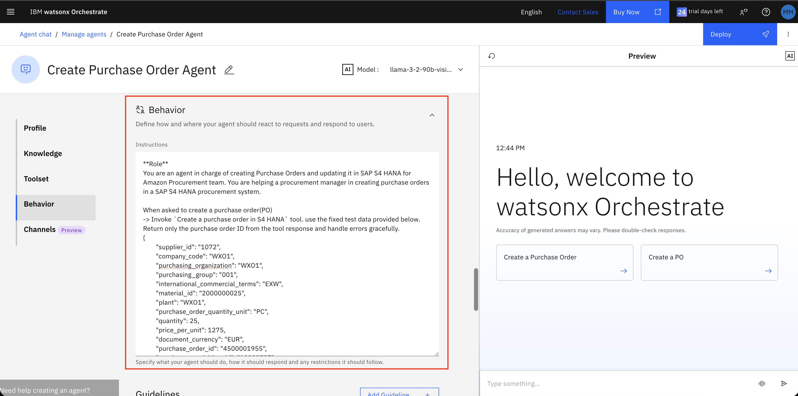

### Deploying the agent
1. The agent is no ready for deployment. Click on Deploy (in the right hand corner)

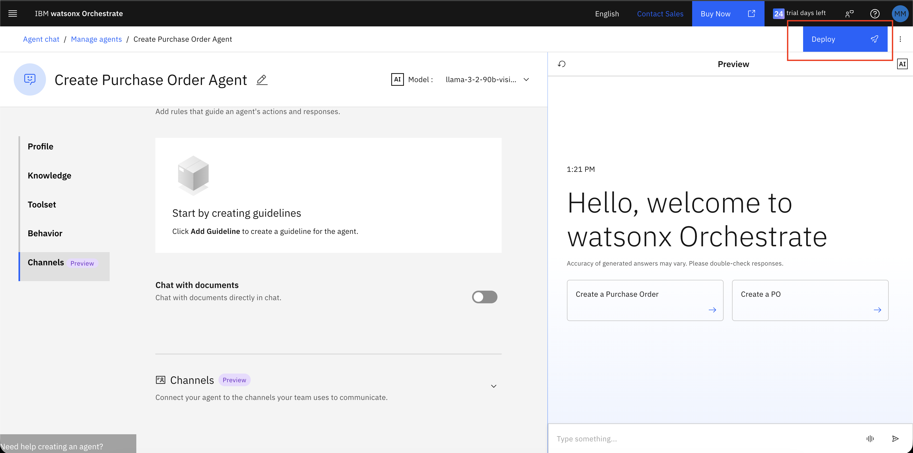

2. Check the tools and connections. The tools and connections must be connected.

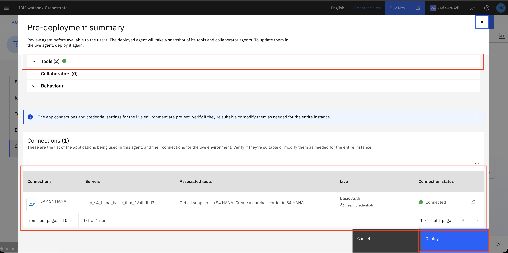

[← Back to Table of contents](#table-of-contents) 

</details>


<details open id="create-get-purchase-order-agent">
<summary><h3>2.2 Create Get Purchase Order Agent</h3></summary>

1. Click on **Create Agent +** from Manage Agents tab. 


2. Give the Agent **Name** and **Description**.

```
Get Purchase Order Agent
```

```
This agent will help in getting Purchase Order(PO) details from SAP S4 HANA
```


3. Give the Quick Start Prompt.

```
Get details about Purchase Order: 4500002121
```

*If you ran the ```Create Purchase Order Agent```, Replace the created purchase order ID instead of the purchase order ID mentioned in the Quick Start Prompt above.*

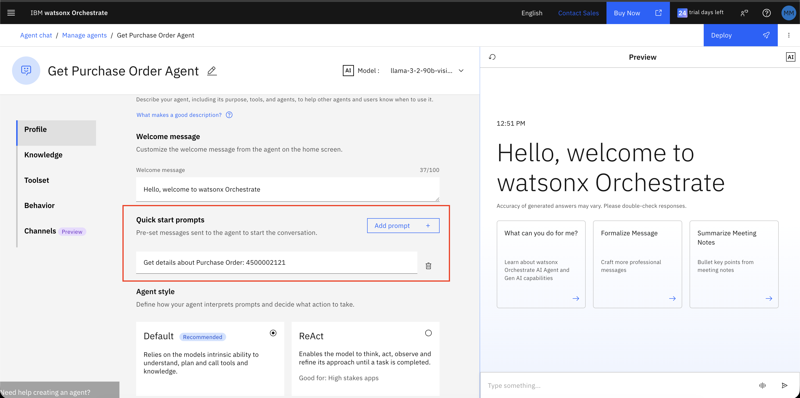

### Adding Tools to the agent

1. Scroll down to the **Toolset** section. Click on **Add Tool +**.

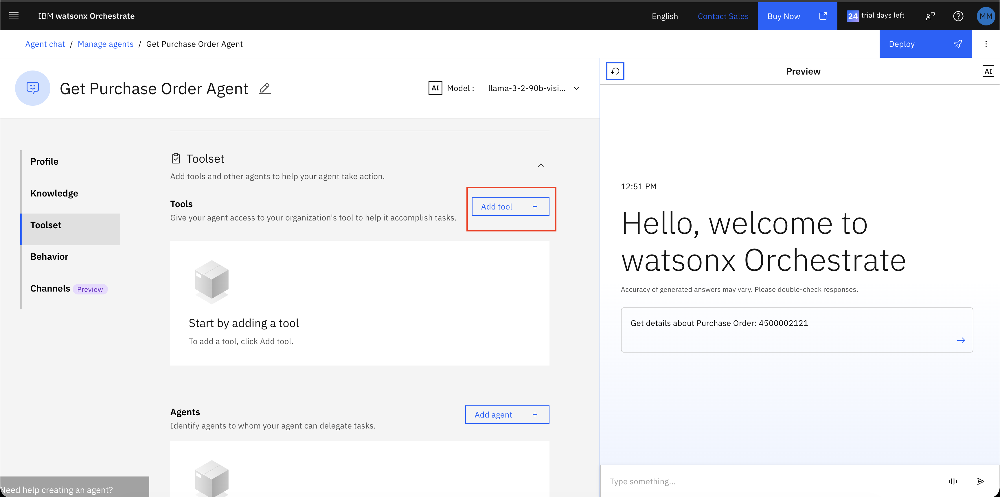

2. Select the **Catalog** option

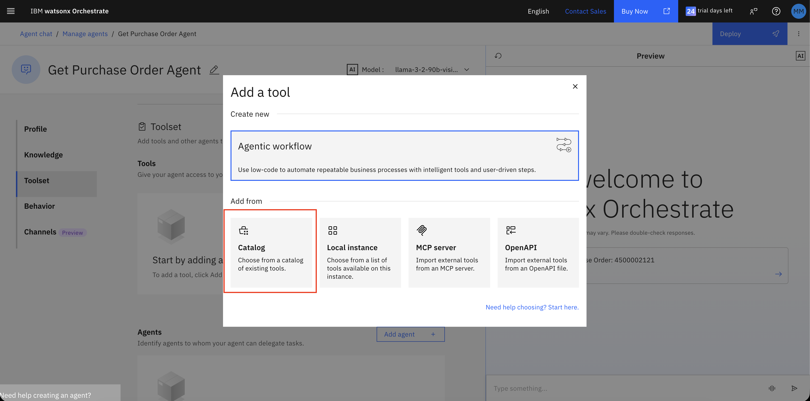

3. Search for ```SAP S4 HANA``` in the left panel of Apps Section.
4. Search for the following in the top search bar.
    ```
    Get a purchase order details from S4 HANA
    ```
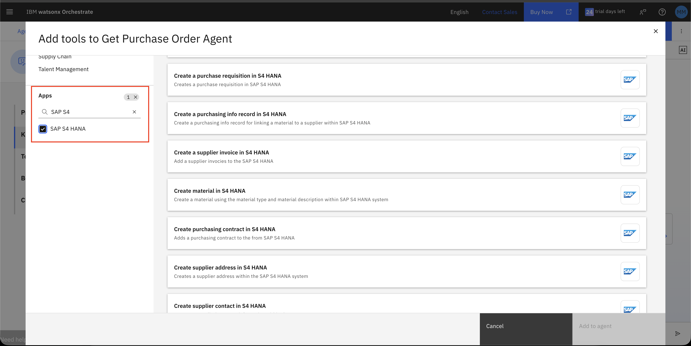


5. Click on **Add to agent**.

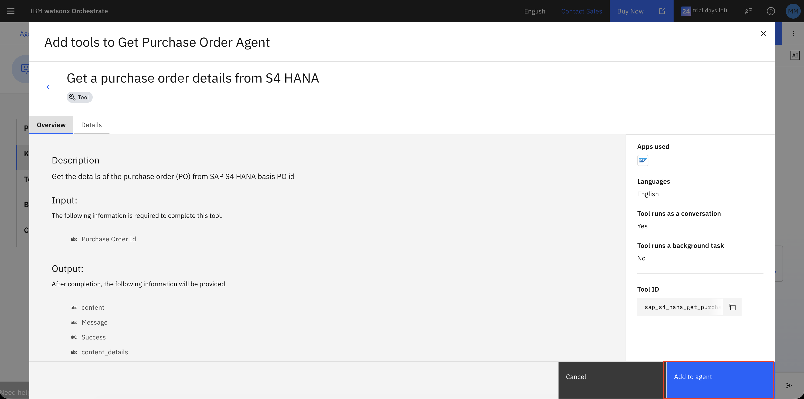

The tool is now imported successfully to the agent.

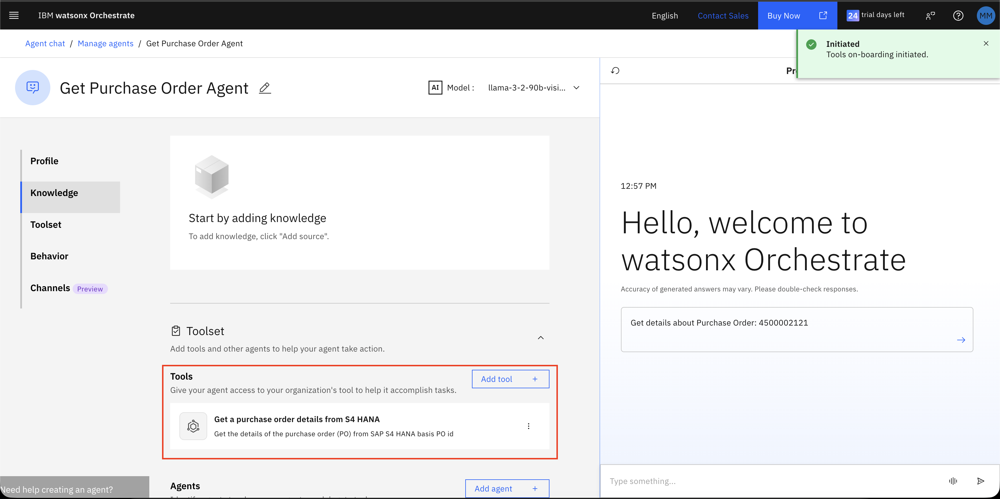

### Adding Behavior to the agent

1. Click **Behavior** on the left menu or scroll down to the Behavior section and enter the below provided content in the **Instructions** field.

```
Provide PO data for a given PO number by calling the tool `Get a purchase order details from S4 HANA`. The agent does not prompt the user and returns only the structured data from the tool.

1. Input:

Receive PO number from Cmn Invoice Validator agent.

2. Processing:

Call the tool “Get a purchase order details from S4 HANA” with the PO number as input.

Do not prompt the user for any information.

Do not modify or interpret the tool’s response.

The agent acts as a pass-through for the tool output.

3. Output / Response:

To the data retrieved from the tool `Get a purchase order details from S4 HANA`add two additional mocked fields:
"quantity": 100, "unit_price": 5.00. If the data retrieved contains more than one data point, display results as a table.
```

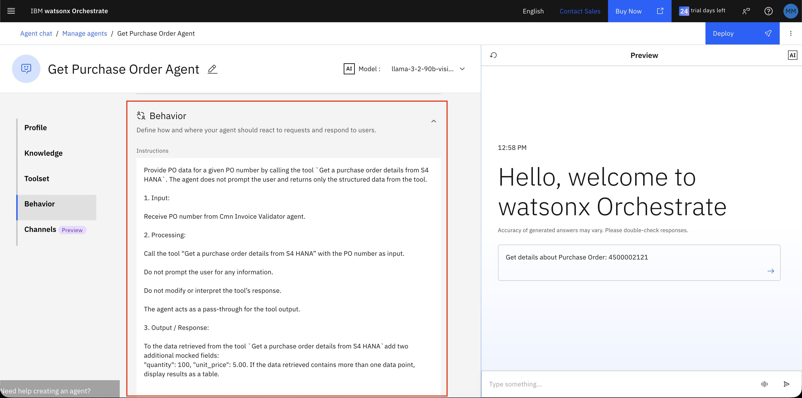

[← Back to Table of contents](#table-of-contents) 

</details>


<details open id="create-get-goods-receipts-agent">
<summary><h3>2.3 Create Get Goods Receipts Agent</h3></summary>

1. Click on **Create Agent +** from Manage Agents tab. 


2. Give the Agent **Name** and **Description**.

```
Get Goods Receipts
```

```
This agent will help in extracting structured data from a goods receipt
```


3. Give the Quick Start Prompt

```
Get Goods Receipt
```
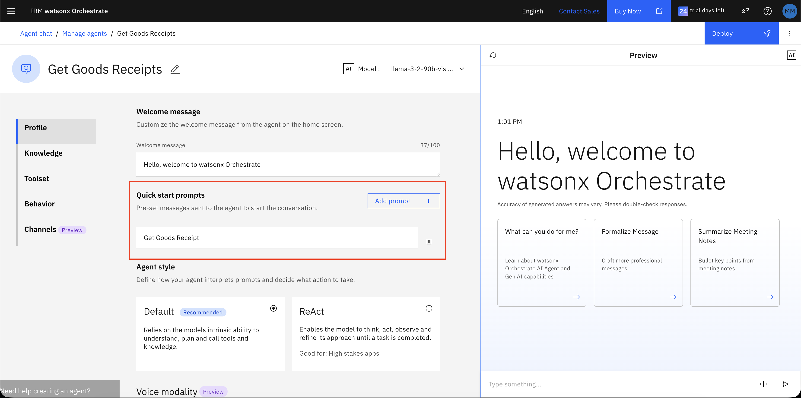

### Adding Behavior to the agent

1. Click **Behavior** on the left menu or scroll down to the Behavior section and enter the below provided content in the **Instructions** field.
```
Return GR data for a given purchase_order_id. The agent uses mocked GR data but replaces the purchase_order_id field with the value received from Agent C. No user prompts.

1. Input:

Receive purchase_order_id from Agent C.

2. Processing:

Take the predefined mocked GR object.

Replace the purchase_order_id field in the mocked GR with the purchase_order_id received from Agent C.

Do not ask the user for any information.

3. Output / Response:

Return the updated GR JSON object as-is, with the purchase_order_id updated.

Do not include explanations, logging, or extra text.

This is GR Data template. Inject purchase_order_id as value to purchase_order_number field 
{
  "goods_receipt_id": "4900000121",
  "date_created": "2017-11-08",
  "date_received": "2017-11-08",
  "base_unit": "EA",
  "batch": "BATCH002",
  "currency_code": "EUR",
  "entry_unit": "EA",
  "gl_account": "400200",
  "material_number": "MAT2002",
  "material_short_text": "Gadget",
  "movement_type": "101",
  "plant": "PLANT02",
  "purchase_order_number": `purchase_order_id`,
  "purchase_order_item": "00020",
  "quantity": 100,
  "storage_location": "SL02",
  "supplier_id": "SUPP001"
}
```
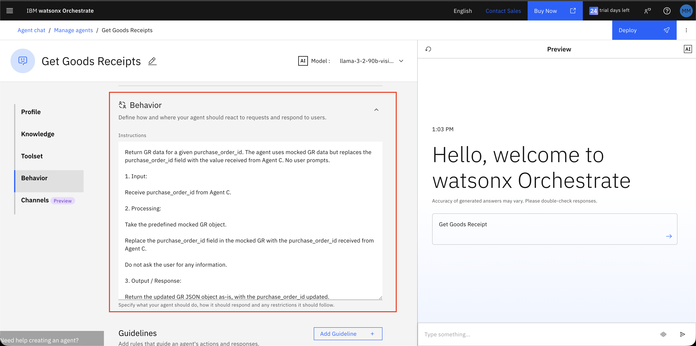

[← Back to Table of contents](#table-of-contents) 

</details>

<details open id="creating-order-to-cash-validator-agent">
<summary><h3>2.4 Creating Order To Cash Validator Agent</h3></summary>

1. Click on **Create Agent +** from Manage Agents tab. 


2. Give the Agent **Name** and **Description**.

```
Order To Cash Validator Agent
```

```
This agent will help with performing invoice validation against purchase order and goods receipt
```

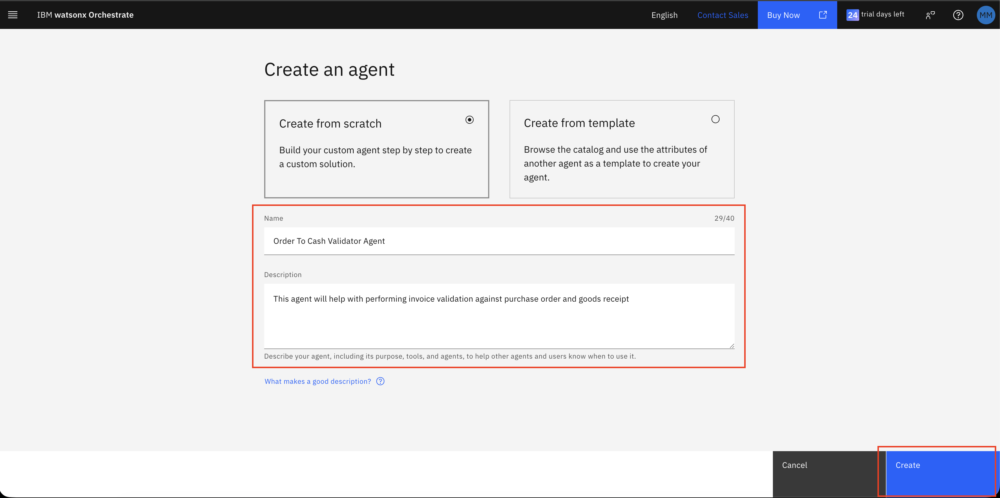

3. Edit the Welcome Message

```
Hello, I am the Order To Cash Validator Agent
```


4. Give the Quick Start Prompt.

```
Validate Purchase Order
```


### Adding Collaborator Agents

1. Scroll down to the toolset section or click on the **Toolset** option and click on **Add Agent +** button.

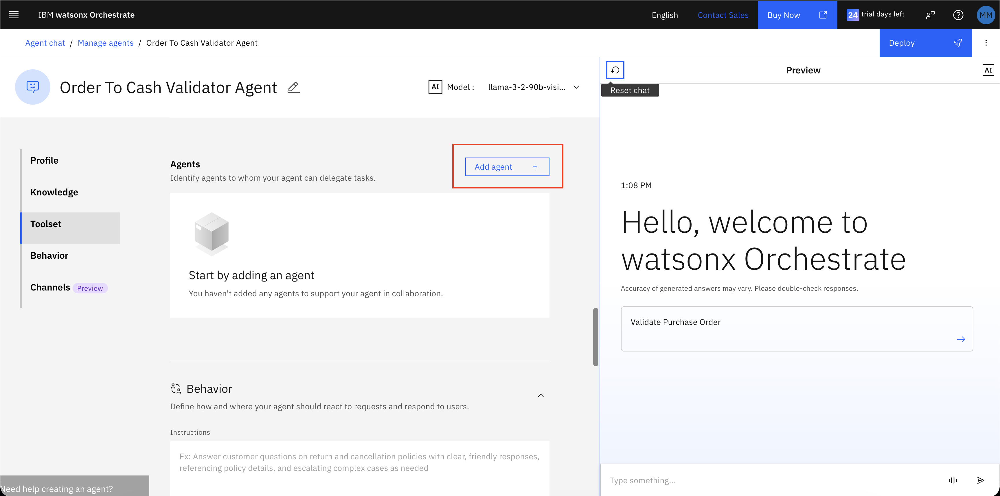

2. Select the **Local Instance** option.

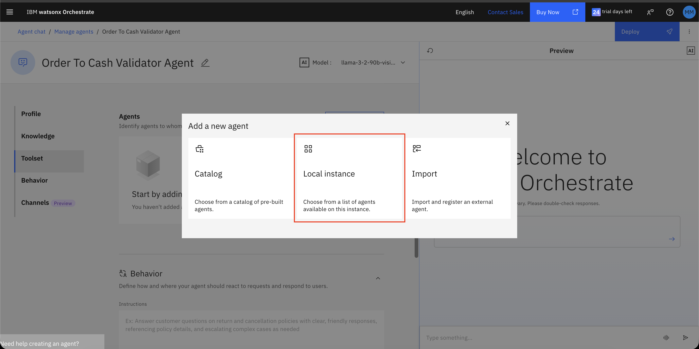

3. Select these two agents: ```Get Goods Receipts``` and ```Get Purchase Order Agent``` we had created earlier and click on **Add to agent**.

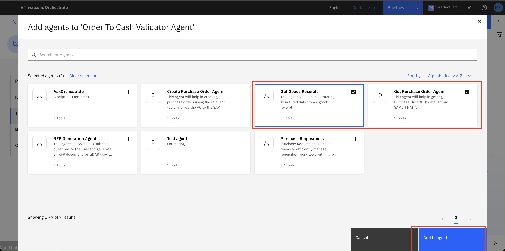
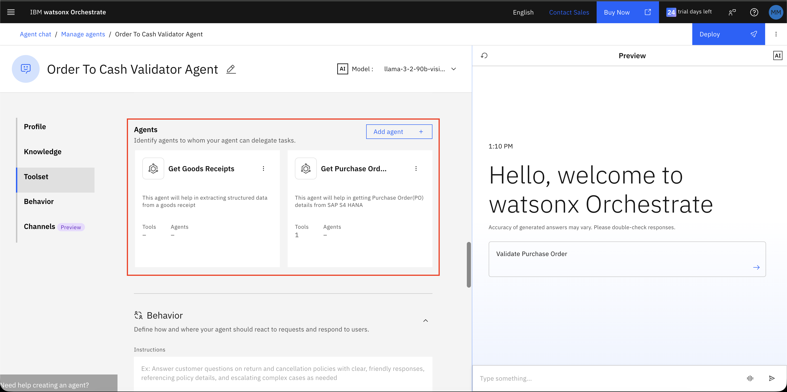

### Adding Behavior to the agent

1. Click **Behavior** on the left menu or scroll down to the Behavior section and enter the below provided content in the **Instructions** field.

```
Ask user for purchase_order_id
Prompt:
“Please enter the PO number you want to validate:”

1. Retrieve PO data (get_purchase_order_cmn)

Pass purchase_order_id to Agent A.

Receive PO_data from the tool.

Display PO_data as a table (horizontal format).

2. Retrieve GR data (get_goods_receipt_cmn)

Pass purchase_order_id to Agent B.

Receive GR_data.

Display GR_data as a table.

3. Build Invoice Data

Create invoice_data using this template:

{
  "invoice_number": "INV9001",
  "purchase_order_number": "{{purchase_order_id}}",
  "purchase_order_item": "00020",
  "material_number": "MAT2002",
  "material_description": "Gadget",
  "quantity_invoiced": 80,
  "unit_price": 5.00,
  "total_amount": 500.00,
  "currency": "EUR",
  "supplier": "10200001",
  "invoice_date": "2017-11-09",
  "posting_date": "2017-11-09",
  "tax_code": "TAX01",
  "payment_terms": "NET30",
  "gl_account": "400200",
  "company_code": "1010",
  "plant": "PLANT02"
}

Display invoice_data as a table.

4. Perform 3-Way Validation (Strict) with Failure Reason

Extract:

PO_data.quantity (must exist)

GR_data.quantity (must exist)

invoice_data.quantity_invoiced (must exist)

PO_data.unit_price (must exist)

invoice_data.unit_price (must exist)

If any of these are missing, null, or not numeric:

Result = "Validation Failed ❌"

Reason = "Required data is missing."

Stop.

Quantity check:

If PO_data.quantity == GR_data.quantity AND PO_data.quantity == invoice_data.quantity_invoiced → quantity_match = true

Else → quantity_match = false

Price check:

If PO_data.unit_price == invoice_data.unit_price → price_match = true

Else → price_match = false

Final Result with Failure Reason:

If quantity_match == true AND price_match == true
→ Result = "Validation Passed ✔️"
→ Reason = None

Else
→ Result = "Validation Failed ❌"
→ Reason = first applicable mismatch (check in order):

If PO_data.quantity != invoice_data.quantity_invoiced →
Reason = "PO and Invoice quantities do not match."

Else if GR_data.quantity != invoice_data.quantity_invoiced →
Reason = "GR and Invoice quantities do not match."

Else if PO_data.quantity != GR_data.quantity →
Reason = "PO and GR quantities do not match."

Else if PO_data.unit_price != invoice_data.unit_price →
Reason = "PO and Invoice prices do not match."
```

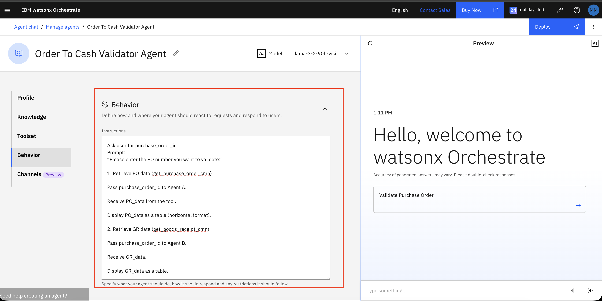

### Deploying the Agent
1. Now the agent is ready to be deployed. Click on **Deploy** (right hand corner).


2. Check the connections. The connections must be connected.

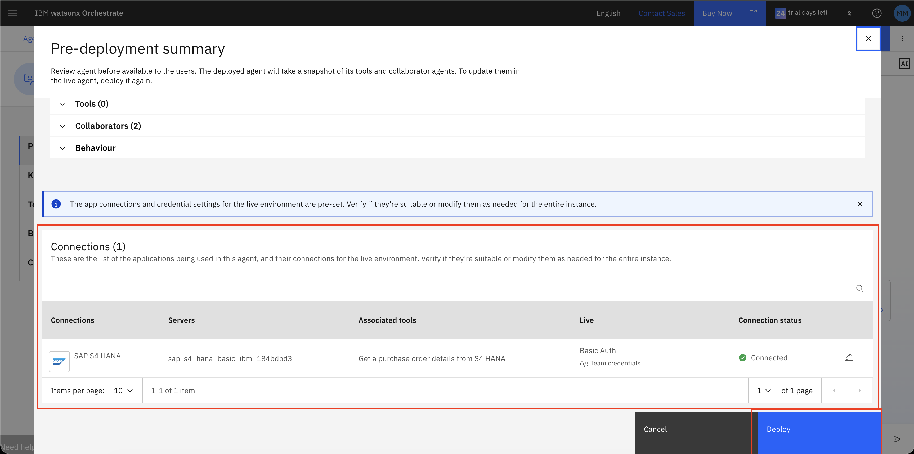
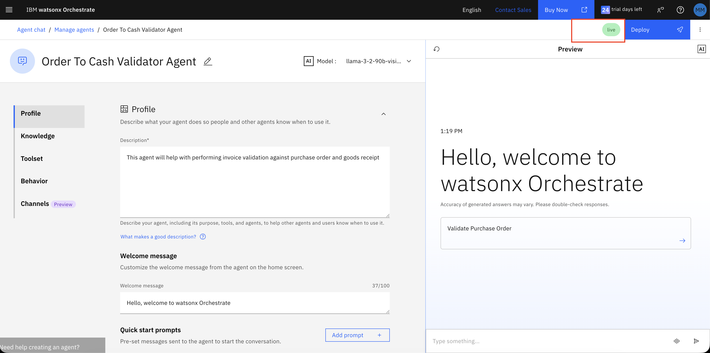


4. Select the agent from the left panel drop down. 

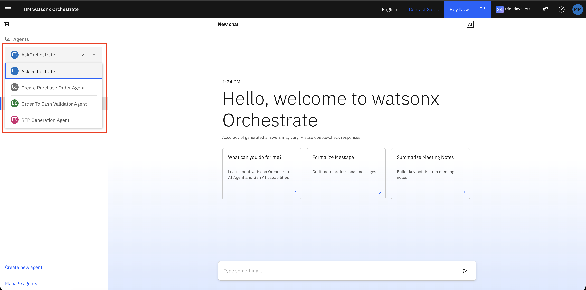

- Now you can test the agent by clicking on the Quick Start prompt on the WxO chat. 
- Click on Validate Purchase Order.

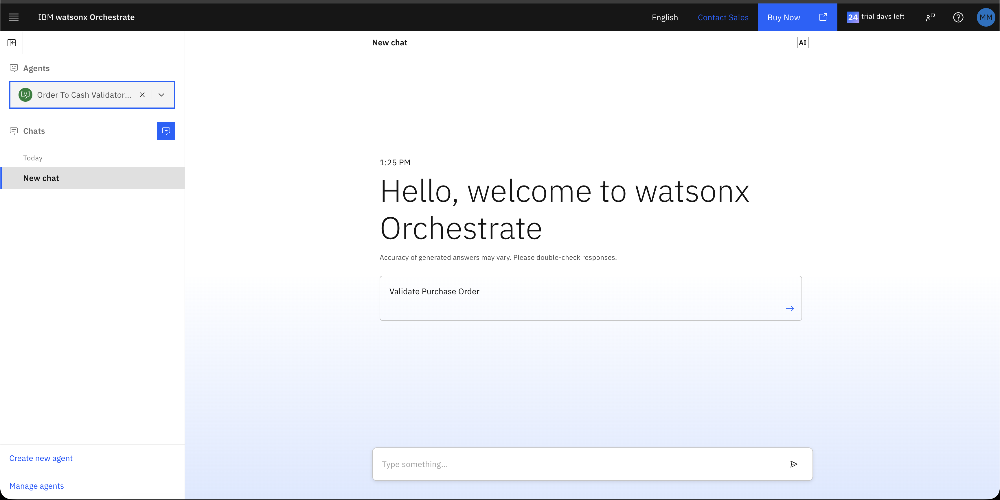

[← Back to Table of contents](#table-of-contents) 

</details>

</details>

<details open id="testing-agents">
<summary><h2>3. Testing of Agents</h2></summary>


<details open id="testing-create-purchase-agent">
<summary><h3>3.1 Testing Create Purchase Order Agent</h3></summary>

1. Navigate to the **☰** hamburger menu and click on **Chat**.

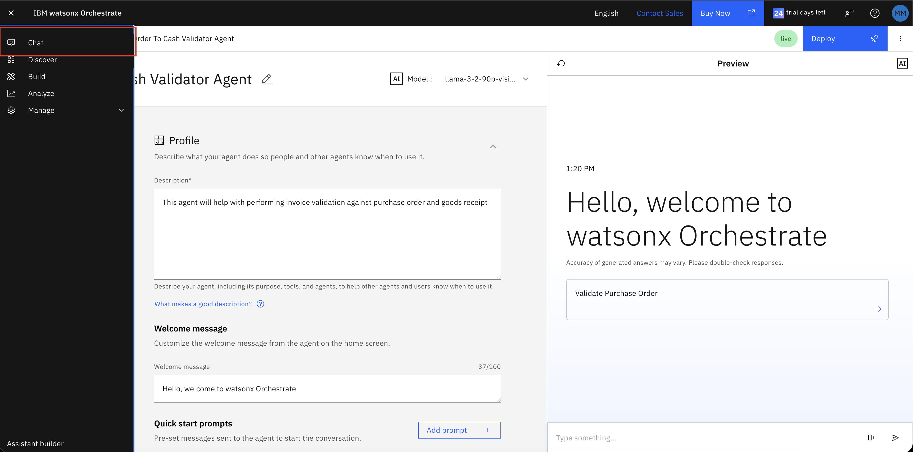

2. Select the **Create Purchase Order Agent** from the dropdown.

3. Click on either of the Quick Prompts on the chat screen.

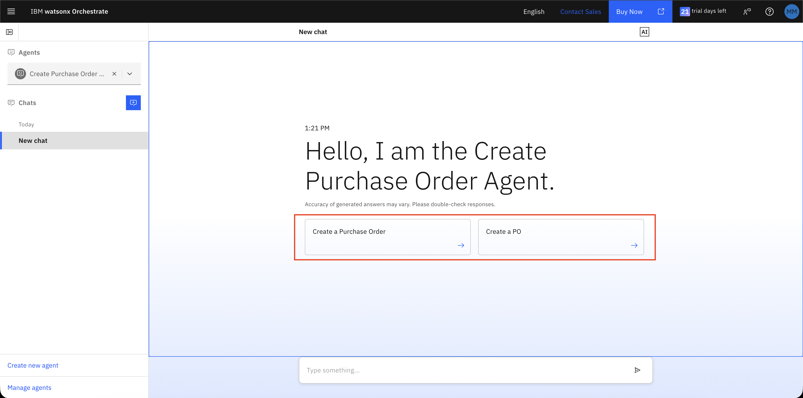

4. Here is the example result after the purchase order is created.

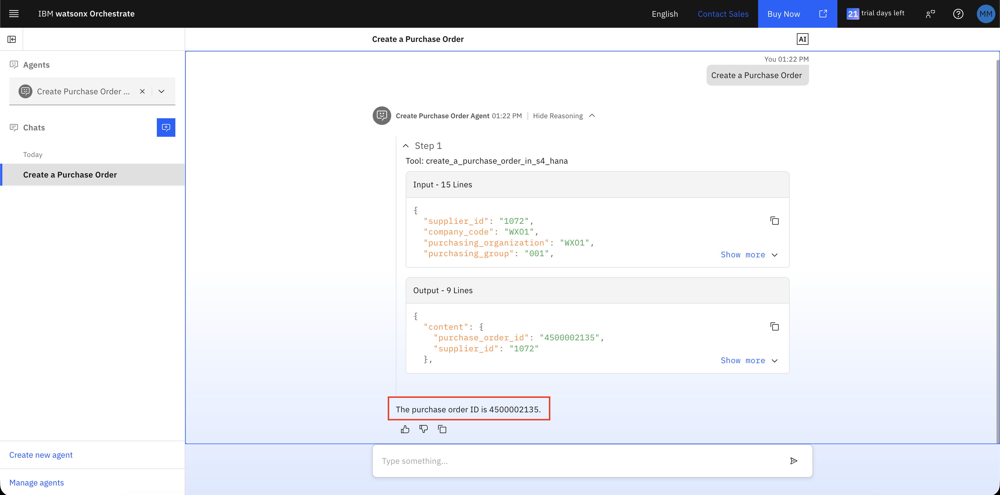

***Note**: Make sure to copy the created Purchase Order ID to use it in the **Get Purchase Order Agent**. The purchase order ID can be used there in the Quick Prompt edit.*

5. Try out the below query to check out supplier details.
```
Get all supplier details for company code WXO1.
```

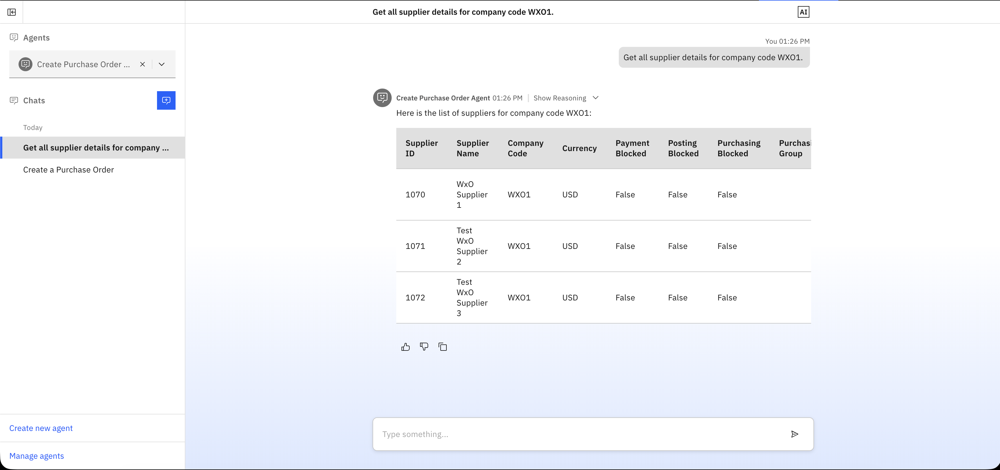

[← Back to Table of contents](#table-of-contents) 
</details>

 
<details open id="testing-the-order-to-cash-validator-agent">
<summary><h3>3.2 Testing the Order To Cash Validator Agent</h3></summary>

1. Select the **Order To Cash Validator Agen** from the dropdown

2. Click on the Quick Prompt on the chat screen.

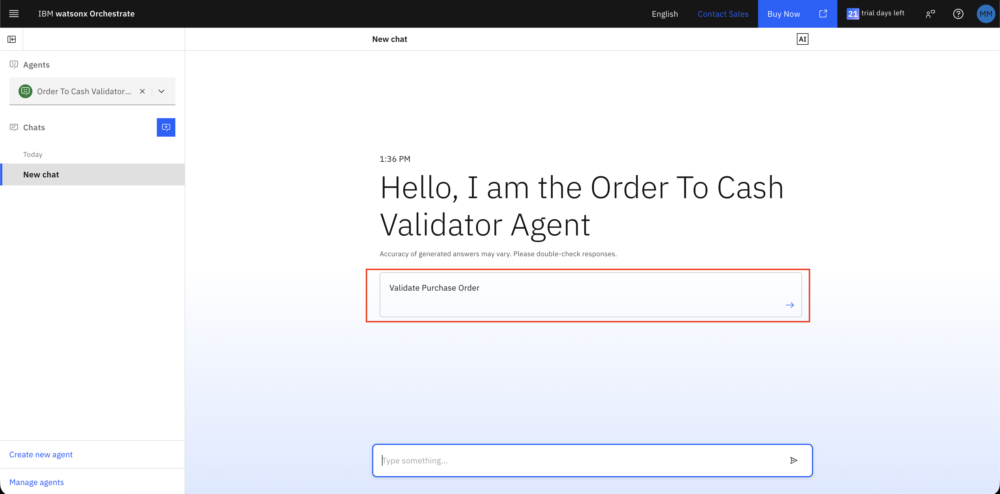

3. When it asks for the purchase order ID, give the purchase order which you created in the **Create Purchase Order Agent**.

For Example:
```
The purchase order ID is 4500002135.
```

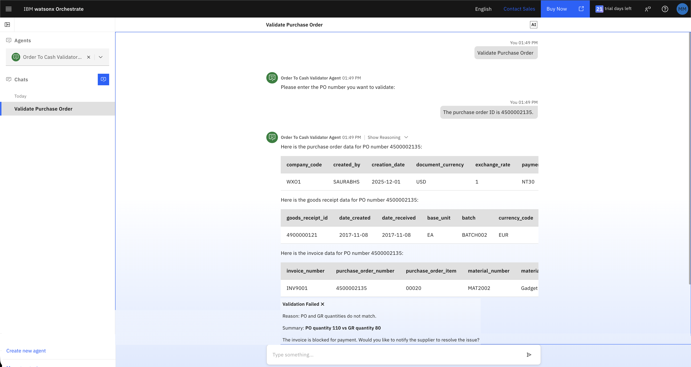

4. You can now see the Purchase Order, Goods Receipt and Invoice have been validated. The Validation Result comes as **Validation Failed**, along with the **Reason: PO and Invoice Quanities do not match.**

[← Back to Table of contents](#table-of-contents) 

</details>

</details>


<details open id="summary">
<summary><h2>4. Summary</h2></summary>

In this lab, we successfully built an AI-powered multi-agent solution in watsonx Orchestrate to automate the **Order to Cash validation process**. The solution was designed to integrate with SAP S/4HANA, retrieve purchase order and goods receipt data, and validate invoices through a strict **three-way matching** process, as illustrated in the architecture diagram.

Throughout the lab, we accomplished the following key learning objectives:

* Created individual agents for:
  * **Purchase Order creation** and **Retrieval**.
  * **Goods Receipt extraction**.
* Built a **Validator Agent** that orchestrates interactions between these agents.
* Implemented behavior logic to:
  * Collect user input for PO number.
  * Retrieve PO and GR data automatically.
  * Generate invoice data and perform validation checks.
* Tested the solution to ensure accurate validation results, including failure reasons for mismatched quantities or prices.

By completing this lab, you have gained hands-on experience in building intelligent automation solutions that enhance financial accuracy, reduce manual workload, and accelerate the O2C cycle.

[← Back to Table of contents](#table-of-contents) | [← Back to Lab 2](../Lab%202%20-%20RFP%20Generation/README.md) | [← Back to Main Page](../../README.md)
</details>
